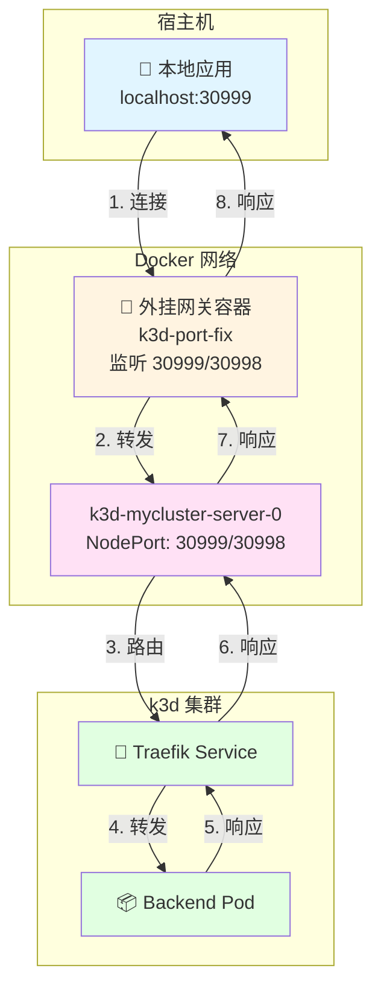

# k3d 集群端口映射解决方案

**版本**: 1.0  
**日期**: 2025-12-25  
**适用对象**: DevOps 工程师、Kubernetes 管理员、本地开发人员

---

## 目录

1. [问题背景](#1-问题背景)
2. [方案一：kubectl port-forward（仅 TCP）](#2-方案一kubectl-port-forward仅-tcp)
3. [方案二：Docker 外挂网关（推荐）](#3-方案二docker-外挂网关推荐)
4. [方案对比](#4-方案对比)
5. [故障排查](#5-故障排查)
6. [最佳实践](#6-最佳实践)

---

## 1. 问题背景

### 1.1 问题描述

在开发过程中，k3d 集群已经包含大量数据和应用，不能直接删除重建。但是：

- **k3d 集群创建时**：没有使用 `-p` 参数映射端口
- **现状**：Traefik 的 NodePort (30999, 30998) 无法从宿主机访问
- **需求**：在不重建集群的情况下，让宿主机能够访问集群内的服务

### 1.2 为什么不能直接修改

k3d 基于 Docker 容器，容器启动后：
- 端口映射是在容器创建时通过 `-p` 参数指定的
- 容器运行后无法动态添加端口映射
- 重建集群会丢失所有数据和应用

### 1.3 解决方案概述

我们提供两种方案：

1. **方案一**：`kubectl port-forward`（仅支持 TCP，最简单）
2. **方案二**：Docker "外挂网关"（支持 TCP + UDP，推荐）

---

## 2. 方案一：kubectl port-forward（仅 TCP）

### 2.1 方案说明

使用 Kubernetes 原生的 `port-forward` 功能，将本地端口转发到集群内的 Service。

**⚠️ 限制**: 标准的 `kubectl port-forward` 目前不支持 UDP，所以这个方法只能测试 TCP 服务。

### 2.2 操作步骤

#### 步骤 1: 确保服务已部署

保持 ArgoCD 部署不变，确保你的 TCP/UDP 服务都已经 Sync 成功：

```bash
# 检查 Traefik Service
kubectl get svc -n traefik traefik

# 检查 TCP 服务
kubectl get pods -n backend -l app=tcp-echo
```

#### 步骤 2: 执行端口转发

把你电脑的 30999 转发到 Traefik Service 的 9999 (TCP 入口)：

```bash
# 格式: kubectl port-forward -n <namespace> svc/<service-name> <本地端口>:<Service端口>
kubectl port-forward -n traefik svc/traefik 30999:9999
```

**说明**:
- `-n traefik`: Traefik Service 所在的命名空间
- `svc/traefik`: Service 名称
- `30999:9999`: 本地端口:Service 端口

#### 步骤 3: 测试连接

新开一个终端窗口：

```bash
# 测试 TCP 连接
nc -v localhost 30999

# 如果连接成功，输入测试数据
# 例如: hello tcp
```

### 2.3 优缺点

**优点**:
- ✅ 无需额外配置
- ✅ 使用 Kubernetes 原生功能
- ✅ 简单直接

**缺点**:
- ❌ 不支持 UDP
- ❌ 需要保持终端窗口运行
- ❌ 重启后需要重新执行

### 2.4 后台运行

如果需要后台运行，可以使用：

```bash
# 后台运行并输出日志到文件
kubectl port-forward -n traefik svc/traefik 30999:9999 > /tmp/port-forward.log 2>&1 &

# 查看进程
ps aux | grep port-forward

# 停止
pkill -f "port-forward.*30999"
```

---

## 3. 方案二：Docker 外挂网关（推荐）

### 3.1 方案说明

创建一个"外挂网关容器"，加入到 k3d 的网络中，将宿主机端口转发到 k3d 集群内部。

**优势**:
- ✅ 支持 TCP 和 UDP
- ✅ 容器自动重启（`--restart always`）
- ✅ 无需保持终端窗口
- ✅ 适合长期使用

### 3.2 架构图



### 3.3 操作步骤

#### 步骤 1: 确定 k3d 网络名称

通常 k3d 的网络名字是 `k3d-<集群名>`。如果不确定，执行：

```bash
docker network ls | grep k3d
```

**示例输出**:
```
NETWORK ID     NAME              DRIVER    SCOPE
abc123def456   k3d-mycluster     bridge    local
```

假设你的集群名叫 `mycluster`，网络名通常是 `k3d-mycluster`。

#### 步骤 2: 确定 k3d 节点的主机名

通常 k3d 的主节点容器名叫 `k3d-<集群名>-server-0`。

```bash
# 查看 k3d 容器
docker ps | grep k3d

# 或者
docker ps --filter "name=k3d" --format "table {{.Names}}\t{{.Image}}"
```

**示例输出**:
```
NAMES                        IMAGE
k3d-mycluster-server-0       rancher/k3s:v1.29.15-k3s1
```

假设容器名叫 `k3d-mycluster-server-0`。

#### 步骤 3: 启动外挂网关容器

**⚠️ 重要**: 请根据你的实际集群名修改下面命令中的网络名和目标主机名。

```bash
# ⚠️ 请修改: --net (你的网络名) 和 TCP/UDP 后面的目标容器名 (你的server-0容器名)

docker run -d --name k3d-port-fix \
  --restart always \
  --net k3d-mycluster \
  -p 30999:30999 \
  -p 30998:30998/udp \
  alpine/socat \
  sh -c "socat TCP4-LISTEN:30999,fork,reuseaddr TCP4:k3d-mycluster-server-0:30999 & \
         socat UDP4-LISTEN:30998,fork,reuseaddr UDP4:k3d-mycluster-server-0:30998"
```

**命令解析**:

| 参数 | 说明 |
|------|------|
| `-d` | 后台运行（detached mode） |
| `--name k3d-port-fix` | 容器名称，方便管理 |
| `--restart always` | 容器自动重启（系统重启后也会自动启动） |
| `--net k3d-mycluster` | **关键**！让容器加入 k3d 的内网，这样它就能解析并访问 k3d 节点 |
| `-p 30999:30999` | 暴露 TCP 端口 30999 |
| `-p 30998:30998/udp` | 暴露 UDP 端口 30998 |
| `alpine/socat` | 一个只有几 MB 的网络工具镜像 |
| `socat TCP4-LISTEN:...` | 建立 TCP 桥梁，监听 30999，转发到 k3d 节点 |
| `socat UDP4-LISTEN:...` | 建立 UDP 桥梁，监听 30998，转发到 k3d 节点 |

**socat 参数说明**:
- `TCP4-LISTEN:30999`: 监听 IPv4 TCP 端口 30999
- `fork`: 为每个连接 fork 新进程
- `reuseaddr`: 允许地址重用
- `TCP4:k3d-mycluster-server-0:30999`: 转发到 k3d 节点的 30999 端口

#### 步骤 4: 验证容器状态

```bash
# 检查容器是否运行
docker ps | grep k3d-port-fix

# 查看容器日志
docker logs k3d-port-fix

# 检查容器网络
docker inspect k3d-port-fix | grep -A 10 "Networks"
```

**预期输出**:
```
CONTAINER ID   IMAGE          STATUS         PORTS
abc123def456   alpine/socat   Up 5 seconds   0.0.0.0:30999->30999/tcp, 0.0.0.0:30998->30998/udp
```

### 3.4 测试验证

#### 3.4.1 测试 TCP 连接

```bash
# 目标变成了 localhost，因为外挂容器在本地
nc -v localhost 30999

# 如果连接成功，输入测试数据
# 例如: hello tcp
```

#### 3.4.2 测试 UDP 连接

```bash
# 目标也是 localhost
# 之前写的 Go 客户端代码中的 IP 需要改成 "127.0.0.1:30998"
nc -v -u localhost 30998

# 输入测试数据
# 例如: hello udp
```

#### 3.4.3 使用 curl 测试（HTTP）

```bash
# 测试 HTTP 服务（如果配置了）
curl -v -H "Host: dev.admin.test.com" http://localhost:30080/admin/user
```

### 3.5 容器管理

#### 停止容器

```bash
docker stop k3d-port-fix
```

#### 启动容器

```bash
docker start k3d-port-fix
```

#### 删除容器

```bash
# 停止并删除
docker stop k3d-port-fix
docker rm k3d-port-fix
```

#### 查看容器日志

```bash
# 实时查看日志
docker logs -f k3d-port-fix

# 查看最近 100 行
docker logs --tail 100 k3d-port-fix
```

---

## 4. 方案对比

| 特性 | 方案一：port-forward | 方案二：外挂网关 |
|------|---------------------|-----------------|
| **TCP 支持** | ✅ 支持 | ✅ 支持 |
| **UDP 支持** | ❌ 不支持 | ✅ 支持 |
| **持久性** | ❌ 需要保持终端运行 | ✅ 容器自动重启 |
| **配置复杂度** | ⭐ 简单 | ⭐⭐ 中等 |
| **资源消耗** | 低 | 极低（几 MB） |
| **适用场景** | 临时测试 | 长期开发 |
| **多端口支持** | 需要多个命令 | 一个容器支持多个端口 |

### 4.1 选择建议

- **临时测试 TCP**: 使用方案一（`kubectl port-forward`）
- **长期开发（TCP + UDP）**: 使用方案二（Docker 外挂网关）
- **生产环境**: 建议使用 LoadBalancer 或 Ingress，而不是 NodePort

---

## 5. 故障排查

### 5.1 问题：port-forward 连接失败

**症状**: `kubectl port-forward` 无法建立连接

**排查步骤**:

```bash
# 1. 检查 Service 是否存在
kubectl get svc -n traefik traefik

# 2. 检查 Service 端口
kubectl get svc -n traefik traefik -o jsonpath='{.spec.ports[*].port}'

# 3. 检查 Pod 是否运行
kubectl get pods -n traefik

# 4. 检查端口是否被占用
lsof -i :30999
# 或
netstat -tlnp | grep 30999
```

**解决方案**:
- 确保 Service 存在且端口正确
- 检查本地端口是否被其他程序占用
- 尝试使用其他本地端口

---

### 5.2 问题：外挂网关容器无法连接 k3d 节点

**症状**: 容器启动成功，但无法转发流量

**排查步骤**:

```bash
# 1. 检查容器是否在正确的网络中
docker inspect k3d-port-fix | grep -A 10 "Networks"

# 2. 检查 k3d 节点容器名是否正确
docker ps | grep k3d.*server-0

# 3. 进入网关容器测试网络连通性
docker exec -it k3d-port-fix sh

# 在容器内执行
ping k3d-mycluster-server-0
nc -zv k3d-mycluster-server-0 30999
```

**解决方案**:
- 确认网络名称正确（`--net k3d-mycluster`）
- 确认 k3d 节点容器名正确
- 检查 k3d 节点是否正常运行

---

### 5.3 问题：UDP 数据报无法到达

**症状**: TCP 正常，但 UDP 无响应

**排查步骤**:

```bash
# 1. 检查 UDP 端口监听
docker exec k3d-port-fix netstat -ulnp

# 2. 检查 socat UDP 进程
docker exec k3d-port-fix ps aux | grep socat

# 3. 检查 k3d 节点 UDP 端口
docker exec k3d-mycluster-server-0 netstat -ulnp | grep 30998
```

**解决方案**:
- 确认 socat UDP 进程正在运行
- 检查 UDP 端口映射是否正确（`-p 30998:30998/udp`）
- 验证 k3d 节点上的 UDP 服务是否正常

---

### 5.4 问题：容器重启后端口映射失效

**症状**: 系统重启后，外挂网关容器未自动启动

**排查步骤**:

```bash
# 1. 检查容器重启策略
docker inspect k3d-port-fix | grep RestartPolicy

# 2. 检查 Docker 服务是否自动启动
systemctl status docker
```

**解决方案**:
- 确保容器使用 `--restart always` 参数
- 确保 Docker 服务设置为开机自启

---

## 6. 最佳实践

### 6.1 端口规划

建议为不同服务规划不同的端口范围：

| 服务类型 | 端口范围 | 示例 |
|---------|---------|------|
| HTTP/HTTPS | 30000-30099 | 30080, 30443 |
| TCP 服务 | 30900-30999 | 30999 |
| UDP 服务 | 30900-30999 | 30998 |
| 数据库 | 30300-30399 | 30306 (MySQL), 30379 (Redis) |

### 6.2 容器命名规范

使用有意义的容器名称，便于管理：

```bash
# 好的命名
docker run -d --name k3d-mycluster-port-forward ...

# 避免的命名
docker run -d --name test ...
```

### 6.3 多端口支持

如果需要转发多个端口，可以扩展 socat 命令：

```bash
docker run -d --name k3d-port-fix \
  --restart always \
  --net k3d-mycluster \
  -p 30999:30999 \
  -p 30998:30998/udp \
  -p 30379:30379 \
  -p 30306:30306 \
  alpine/socat \
  sh -c "socat TCP4-LISTEN:30999,fork,reuseaddr TCP4:k3d-mycluster-server-0:30999 & \
         socat UDP4-LISTEN:30998,fork,reuseaddr UDP4:k3d-mycluster-server-0:30998 & \
         socat TCP4-LISTEN:30379,fork,reuseaddr TCP4:k3d-mycluster-server-0:30379 & \
         socat TCP4-LISTEN:30306,fork,reuseaddr TCP4:k3d-mycluster-server-0:30306"
```

### 6.4 监控和维护

#### 定期检查容器状态

```bash
# 创建检查脚本
cat > /usr/local/bin/check-k3d-gateway.sh << 'EOF'
#!/bin/bash
if ! docker ps | grep -q k3d-port-fix; then
    echo "Warning: k3d-port-fix container is not running!"
    docker ps -a | grep k3d-port-fix
fi
EOF

chmod +x /usr/local/bin/check-k3d-gateway.sh
```

#### 添加到 crontab

```bash
# 每 5 分钟检查一次
*/5 * * * * /usr/local/bin/check-k3d-gateway.sh >> /var/log/k3d-gateway-check.log 2>&1
```

### 6.5 关于 ApplicationSet 的处理

**重要**: 你的 `application-dev.yaml` 不需要做任何特殊的修改来适应 k3d。

**原因**:
- ApplicationSet 的任务是把 Deployment/Service/Ingress 部署到 K8s 里
- 至于 K8s 里的端口能不能被你电脑访问到，那是**基础设施层（Infrastructure）**的问题
- 不是**应用定义层（Application Definition）**的问题

**GitOps 流程保持不变**:
1. GitOps: 保持原样提交，让 ArgoCD 正常同步
2. Infra: 运行上面的 `docker run ... socat` 命令打通网络隧道
3. Dev: 愉快地在本地连接 `localhost` 进行 TCP/UDP 开发测试

---

## 附录

### A. 快速参考命令

#### 创建外挂网关（单行命令）

```bash
# 替换 <cluster-name> 为你的集群名
CLUSTER_NAME="mycluster"
docker run -d --name k3d-port-fix \
  --restart always \
  --net k3d-${CLUSTER_NAME} \
  -p 30999:30999 -p 30998:30998/udp \
  alpine/socat \
  sh -c "socat TCP4-LISTEN:30999,fork,reuseaddr TCP4:k3d-${CLUSTER_NAME}-server-0:30999 & socat UDP4-LISTEN:30998,fork,reuseaddr UDP4:k3d-${CLUSTER_NAME}-server-0:30998"
```

#### 检查命令

```bash
# 检查容器状态
docker ps | grep k3d-port-fix

# 检查端口监听
netstat -tlnp | grep -E "30999|30998"

# 检查容器日志
docker logs k3d-port-fix

# 测试连接
nc -v localhost 30999
nc -v -u localhost 30998
```

### B. 常见问题 FAQ

**Q: 为什么不能直接在 k3d 创建时加 `-p` 参数？**

A: 因为集群已经创建并包含大量数据，重建会丢失所有内容。这个方案允许在不重建的情况下添加端口映射。

**Q: 外挂网关容器会影响性能吗？**

A: 不会。socat 是一个非常轻量的工具，容器只有几 MB，性能开销可以忽略不计。

**Q: 可以同时使用两种方案吗？**

A: 可以，但要注意端口冲突。如果使用外挂网关，就不需要 `port-forward` 了。

**Q: 生产环境应该用什么方案？**

A: 生产环境建议使用 LoadBalancer 或 Ingress，而不是 NodePort。这个方案主要用于本地开发。

### C. 参考资源

- [k3d 官方文档](https://k3d.io/)
- [Docker 网络文档](https://docs.docker.com/network/)
- [socat 文档](http://www.dest-unreach.org/socat/doc/socat.html)
- [kubectl port-forward 文档](https://kubernetes.io/docs/reference/generated/kubectl/kubectl-commands#port-forward)

---

**文档维护**: 本文档应随 k3d 和 Docker 版本更新及时更新。  
**最后更新**: 2025-12-25

