# Kustomize TCP 服务配置指南

**版本**: 1.0  
**日期**: 2025-12-25  
**适用对象**: DevOps 工程师、Kubernetes 管理员

---

## Table of Contents

1. [Project Structure Standardization](#1-project-structure-standardization)
2. [Traefik TCP Architecture and Principles](#2-traefik-tcp-architecture-and-principles)
3. [Base Layer Configuration Details](#3-base-layer-configuration-details)
4. [Overlay Layer Configuration Details](#4-overlay-layer-configuration-details)
5. [Multi-TCP Service Architecture Solutions](#5-multi-tcp-service-architecture-solutions)
6. [Best Practices](#6-best-practices)

---

## 1. Project Structure Standardization

### 1.1 Standard Directory Structure

为了保持项目结构的高度一致性（Standardization），这是 GitOps 的最佳实践。这样做的好处是：任何人在维护项目时，看到目录结构就知道：`base` 放通用配置，`overlays` 放环境差异化补丁（资源限制、副本数、特定路由规则等）。

**标准结构**:
```
apps/backend/
├── hello-api/
│   ├── base/
│   │   ├── deployment.yaml
│   │   ├── ingress.yaml
│   │   ├── kustomization.yaml
│   │   └── service.yaml
│   └── overlays/
│       └── development/
│           ├── ingress-traefik-patch.yaml
│           ├── kustomization.yaml
│           └── patch-resources.yaml
└── tcp-demo/
    ├── base/
    │   ├── deployment.yaml
    │   ├── ingress-route-tcp.yaml
    │   ├── kustomization.yaml
    │   └── service.yaml
    └── overlays/
        └── development/
            ├── ingress-traefik-patch.yaml
            ├── kustomization.yaml
            └── patch-resources.yaml
```

### 1.2 Structure Description

- **Base 层**: 定义"是什么"（这有一个 TCP 路由）
- **Overlay 层**: 定义"怎么用"（开发环境用 mytcp 入口，打上 dev 标签）

---

## 2. Traefik TCP Architecture and Principles

Before diving into the specific YAML configurations, let's understand the overall architecture and working principles of Traefik TCP, which will help you better understand the subsequent configuration content.

### 2.1 Overall Architecture Diagram

The complete architecture of Traefik TCP services includes multiple layers, from client requests to backend Pod responses:

```mermaid
graph TB
    subgraph "External Access Layer"
        Client[👤 Client<br/>nc/telnet/Application]
    end

    subgraph "Kubernetes Cluster"
        subgraph "Node Layer"
            NodePort[🔌 NodePort:30999<br/>All nodes listening]
        end

        subgraph "Traefik Namespace"
            TraefikSvc[🔌 Traefik Service<br/>ClusterIP]
            TraefikPod[🚀 Traefik Pod<br/>Listening on 9999/tcp]
            EntryPoint[📥 EntryPoint: mytcp<br/>:9999/tcp]
        end

        subgraph "Routing Decision Layer"
            IngressRouteTCP[📋 IngressRouteTCP<br/>tcp-echo-route]
            Router[🎯 Router<br/>HostSNI: *]
        end

        subgraph "Backend Namespace"
            BackendSvc[🔌 tcp-echo-service<br/>ClusterIP:3333]
            BackendPod1[📦 tcp-echo Pod 1<br/>IP: 192.168.36.102]
            BackendPod2[📦 tcp-echo Pod 2<br/>IP: 192.168.36.103]
        end
    end

    Client -->|1. TCP Connection<br/>NodeIP:30999| NodePort
    NodePort -->|2. Forward to Service| TraefikSvc
    TraefikSvc -->|3. Load Balance| TraefikPod
    TraefikPod -->|4. Receive Traffic| EntryPoint
    EntryPoint -->|5. Query Routing Rules| IngressRouteTCP
    IngressRouteTCP -->|6. Match Rules| Router
    Router -->|7. Find Backend Service| BackendSvc
    BackendSvc -->|8. Load Balance| BackendPod1
    BackendSvc -->|8. Load Balance| BackendPod2
    BackendPod1 -->|9. Response Data| TraefikPod
    BackendPod2 -->|9. Response Data| TraefikPod
    TraefikPod -->|10. Return Response| Client

    style Client fill:#e1f5ff
    style NodePort fill:#fff4e1
    style TraefikPod fill:#ffe1f5
    style EntryPoint fill:#ffe1f5
    style IngressRouteTCP fill:#e1ffe1
    style Router fill:#e1ffe1
    style BackendSvc fill:#fff4e1
    style BackendPod1 fill:#e1ffe1
    style BackendPod2 fill:#e1ffe1
```



### 2.2 TCP Routing Principle Diagram

The core of Traefik TCP routing lies in the matching mechanism between EntryPoint and IngressRouteTCP:

```mermaid
graph LR
    subgraph "Traefik Routing Decision Flow"
        TCP[📥 TCP Traffic<br/>Enter EntryPoint: mytcp]
        
        subgraph "Route Matching"
            CheckEntryPoint{Check EntryPoint<br/>Is it mytcp?}
            CheckRoute{Check Routing Rules<br/>HostSNI Match?}
            CheckService{Check Backend Service<br/>Does Service Exist?}
        end

        subgraph "Backend Selection"
            SelectPod[Select Pod<br/>Load Balance]
        end

        Success[✅ Forward Success]
        Fail[❌ Connection Refused]
    end

    TCP --> CheckEntryPoint
    CheckEntryPoint -->|Yes| CheckRoute
    CheckEntryPoint -->|No| Fail
    CheckRoute -->|HostSNI: *<br/>Match All| CheckService
    CheckRoute -->|No Match| Fail
    CheckService -->|Service Exists<br/>Endpoints Available| SelectPod
    CheckService -->|Service Not Found<br/>or Empty Endpoints| Fail
    SelectPod --> Success

    style TCP fill:#e1f5ff
    style CheckEntryPoint fill:#fff4e1
    style CheckRoute fill:#fff4e1
    style CheckService fill:#fff4e1
    style SelectPod fill:#e1ffe1
    style Success fill:#c8e6c9
    style Fail fill:#ffcdd2
```



**Key Points**:

1. **EntryPoint Matching**: Traefik first checks if traffic enters the correct EntryPoint (e.g., `mytcp`)
2. **Routing Rule Matching**: For pure TCP (non-TLS), must use `HostSNI('*')` to match all traffic
3. **Service Discovery**: Traefik queries Service and Endpoints through Kubernetes API
4. **Load Balancing**: If there are multiple Pods, Traefik performs load balancing

### 2.3 Data Flow Sequence Diagram

The complete TCP request-response flow is as follows:

```mermaid
sequenceDiagram
    participant Client as 👤 Client
    participant NodePort as 🔌 NodePort:30999
    participant TraefikSvc as 🔌 Traefik Service
    participant TraefikPod as 🚀 Traefik Pod
    participant K8sAPI as 🧠 K8s API Server
    participant IngressRouteTCP as 📋 IngressRouteTCP
    participant BackendSvc as 🔌 Backend Service
    participant BackendPod as 📦 Backend Pod

    Note over Client,BackendPod: Initialization Phase (When Traefik Starts)
    TraefikPod->>K8sAPI: 1. Watch IngressRouteTCP Resources
    K8sAPI-->>TraefikPod: 2. Push IngressRouteTCP Changes
    TraefikPod->>TraefikPod: 3. Parse Routing Rules<br/>EntryPoint: mytcp<br/>HostSNI: *
    TraefikPod->>K8sAPI: 4. Query Service and Endpoints
    K8sAPI-->>TraefikPod: 5. Return Backend Pod IP List
    TraefikPod->>TraefikPod: 6. Build Routing Table (In Memory)

    Note over Client,BackendPod: Request Processing Phase
    Client->>NodePort: 7. TCP Connection Request<br/>NodeIP:30999
    NodePort->>TraefikSvc: 8. Forward to Traefik Service
    TraefikSvc->>TraefikPod: 9. Load Balance to Traefik Pod
    TraefikPod->>TraefikPod: 10. Match EntryPoint: mytcp
    TraefikPod->>TraefikPod: 11. Match Routing Rules<br/>HostSNI: * (Match All)
    TraefikPod->>BackendSvc: 12. Query Service Endpoints
    BackendSvc-->>TraefikPod: 13. Return Pod IP: 192.168.36.102:3333
    TraefikPod->>BackendPod: 14. Establish TCP Connection<br/>Forward Data Stream
    BackendPod-->>TraefikPod: 15. Return Response Data
    TraefikPod-->>TraefikSvc: 16. Return Response
    TraefikSvc-->>NodePort: 17. Return Response
    NodePort-->>Client: 18. TCP Response Data
```



### 2.4 HTTP vs TCP Routing Comparison

To better understand the special nature of TCP routing, we compare the differences between HTTP and TCP routing:

```mermaid
graph TB
    subgraph "HTTP Routing (Layer 7)"
        HTTPClient[👤 HTTP Client]
        HTTPTraefik[🚀 Traefik]
        HTTPRouter{Routing Decision}
        HTTPRule1[Rule 1: Host=a.com]
        HTTPRule2[Rule 2: Host=b.com]
        HTTPSvc1[Service A]
        HTTPSvc2[Service B]
        
        HTTPClient -->|Host: a.com| HTTPTraefik
        HTTPTraefik --> HTTPRouter
        HTTPRouter -->|Match| HTTPRule1
        HTTPRouter -->|Match| HTTPRule2
        HTTPRule1 --> HTTPSvc1
        HTTPRule2 --> HTTPSvc2
    end

    subgraph "TCP Routing (Layer 4)"
        TCPClient[👤 TCP Client]
        TCPTraefik[🚀 Traefik]
        TCPEntryPoint1[EntryPoint: mytcp<br/>:9999]
        TCPEntryPoint2[EntryPoint: redis<br/>:6379]
        TCPRouter{Routing Decision<br/>HostSNI: *}
        TCPSvc1[Service A]
        TCPSvc2[Service B]
        
        TCPClient -->|Port 30999| TCPTraefik
        TCPTraefik --> TCPEntryPoint1
        TCPEntryPoint1 --> TCPRouter
        TCPRouter -->|Can Only Match One| TCPSvc1
        
        TCPClient -.->|Port 30379| TCPTraefik
        TCPTraefik -.-> TCPEntryPoint2
        TCPEntryPoint2 -.-> TCPSvc2
    end

    style HTTPClient fill:#e1f5ff
    style HTTPTraefik fill:#ffe1f5
    style HTTPRouter fill:#fff4e1
    style HTTPSvc1 fill:#e1ffe1
    style HTTPSvc2 fill:#e1ffe1
    
    style TCPClient fill:#e1f5ff
    style TCPTraefik fill:#ffe1f5
    style TCPRouter fill:#fff4e1
    style TCPSvc1 fill:#e1ffe1
    style TCPSvc2 fill:#e1ffe1
```



**Key Differences**:

| Feature | HTTP (Layer 7) | TCP (Layer 4) |
|---------|----------------|--------------|
| **Port Reuse** | ✅ Yes (via Host Header) | ❌ No (one port per service) |
| **Routing Basis** | Host Header, Path, Headers, etc. | EntryPoint (Port) |
| **Matching Rules** | Exact Match (e.g., `Host: a.com`) | Wildcard Match (`HostSNI: *`) |
| **TLS Support** | Can read SNI information | Pure TCP cannot, TLS can |
| **Service Count** | One port can serve multiple | One port can only serve one |

### 2.5 Multi-TCP Service Port Allocation Diagram

When there are multiple TCP services, each service needs an independent EntryPoint and port:

```mermaid
graph TB
    subgraph "Traefik Configuration"
        Traefik[🚀 Traefik Pod]
        
        subgraph "EntryPoints"
            EP1[EntryPoint: mytcp<br/>Listen :9999/tcp]
            EP2[EntryPoint: redis<br/>Listen :6379/tcp]
            EP3[EntryPoint: mysql<br/>Listen :3306/tcp]
        end
    end

    subgraph "NodePort Mapping"
        NP1[NodePort: 30999]
        NP2[NodePort: 30379]
        NP3[NodePort: 30306]
    end

    subgraph "Backend Services"
        Svc1[tcp-echo-service<br/>:3333]
        Svc2[redis-service<br/>:6379]
        Svc3[mysql-service<br/>:3306]
    end

    NP1 -->|Map to| EP1
    NP2 -->|Map to| EP2
    NP3 -->|Map to| EP3

    EP1 -->|Route to| Svc1
    EP2 -->|Route to| Svc2
    EP3 -->|Route to| Svc3

    style Traefik fill:#ffe1f5
    style EP1 fill:#fff4e1
    style EP2 fill:#fff4e1
    style EP3 fill:#fff4e1
    style NP1 fill:#e1f5ff
    style NP2 fill:#e1f5ff
    style NP3 fill:#e1f5ff
    style Svc1 fill:#e1ffe1
    style Svc2 fill:#e1ffe1
    style Svc3 fill:#e1ffe1
```



**Port Allocation Logic**:

1. **NodePort**: External access port (e.g., 30999)
2. **EntryPoint**: Internal listening port in Traefik (e.g., 9999)
3. **Service Port**: Backend service port (e.g., 3333)

Each TCP service needs such an independent port mapping.

---

## 3. Base Layer Configuration Details

### 3.1 Deployment Configuration

**File**: `apps/backend/tcp-demo/base/deployment.yaml`

```yaml
apiVersion: apps/v1
kind: Deployment
metadata:
  name: tcp-echo-demo
  namespace: backend
  labels:
    app: tcp-echo
spec:
  # [副本数]
  # 这是 Base 的默认值。
  # 在 overlays/development/patch-resources.yaml 中，我们会把它覆盖为 1。
  # 在生产环境可能保留这个 10 或者设置更多。
  replicas: 10

  selector:
    matchLabels:
      app: tcp-echo # 必须匹配 template 里的标签

  template:
    metadata:
      labels:
        app: tcp-echo # 必须匹配 Service 的 selector
    spec:
      containers:
        - name: proxy
          # [核心技巧：镜像占位符]
          # 这里写的不是真实的镜像地址，而是一个逻辑名称。
          # 真实的镜像地址 (newName) 和版本 (newTag) 会在 overlays/*/kustomization.yaml 中
          # 通过 'images' 字段动态替换。
          # 好处：Base 文件与具体镜像仓库解耦。
          image: tcp-echo-server

          ports:
            - containerPort: 3333 # 容器应用实际监听的端口
```

**关键点**:
- **镜像占位符**: `image: tcp-echo-server` 不是真实镜像，而是逻辑名称
- **标签匹配**: Deployment 的 selector 和 template labels 必须一致
- **解耦设计**: Base 层不依赖具体镜像仓库

---

### 3.2 Service Configuration

**File**: `apps/backend/tcp-demo/base/service.yaml`

```yaml
apiVersion: v1
kind: Service
metadata:
  name: tcp-echo-service
  namespace: backend
spec:
  # [服务类型]
  # 这里省略了 type 字段，默认是 ClusterIP。
  # 意味着这个 Service 只能在集群内部访问，外部访问必须通过 Traefik Ingress。

  ports:
    - port: 3333        # [集群内端口] Service 在 ClusterIP 上监听的端口 (Traefik 访问这个)
      targetPort: 3333  # [容器端口] 流量转发给 Pod 里容器实际监听的端口
      name: tcp         # 端口命名，好习惯，方便引用

  # [标签选择器]
  # 只有带有 app=tcp-echo 标签的 Pod 才会成为这个 Service 的后端。
  selector:
    app: tcp-echo
```

**端口映射说明**:
- `port`: Service 在集群内的端口（Traefik 访问这个）
- `targetPort`: Pod 容器实际监听的端口
- `name`: 端口名称，便于引用

---

### 3.3 IngressRouteTCP Configuration

**File**: `apps/backend/tcp-demo/base/ingress-route-tcp.yaml`

```yaml
apiVersion: traefik.io/v1alpha1
kind: IngressRouteTCP # 注意：这是 Traefik 专用的 CRD，专门处理 TCP 流量
metadata:
  name: tcp-echo-route
  namespace: backend
spec:
  # [入口点绑定]
  # 必须对应 Traefik 启动参数 (traefik-app.yaml) 中定义的 entryPoint。
  # 比如: --entrypoints.mytcp.address=:9999/tcp
  entryPoints:
    - mytcp

  routes:
    # [路由匹配规则]
    # HostSNI(`*`) 的含义：
    # 1. 对于 HTTPS (TLS)，Traefik 可以读取 SNI 信息来区分域名 (如 HostSNI(`example.com`))。
    # 2. 对于 纯 TCP (非 TLS)，数据流是黑盒，Traefik 无法看到域名信息。
    # 3. 因此，必须使用通配符 `*`，表示"所有从 mytcp 端口进来的流量，不管发给谁，都无脑转发给后端"。
    - match: HostSNI(`*`)
      services:
        - name: tcp-echo-service # 转发给哪个 Service
          port: 3333             # Service 的端口
```

**关键点**:
- **CRD 资源**: `IngressRouteTCP` 是 Traefik 自定义资源，专门处理 TCP 流量
- **HostSNI(`*`)**: 纯 TCP（非 TLS）必须使用通配符，因为无法读取域名信息
- **EntryPoint**: 必须对应 Traefik 配置中的 entryPoint 名称

---

### 3.4 Kustomization Aggregation

**File**: `apps/backend/tcp-demo/base/kustomization.yaml`

```yaml
apiVersion: kustomize.config.k8s.io/v1beta1
kind: Kustomization

# [资源清单]
# 列出当前目录下所有需要被包含进来的 YAML 文件。
# ArgoCD 或者 'kubectl apply -k' 会读取这个列表并把它们合并成一个流。
resources:
  - deployment.yaml
  - service.yaml
  - ingress-route-tcp.yaml
```

---

## 4. Overlay Layer Configuration Details

### 4.1 Resource Limit Patch

**File**: `apps/backend/tcp-demo/overlays/development/patch-resources.yaml`

```yaml
# -----------------------------------------------------------------
# 文件名: apps/backend/tcp-demo/overlays/development/patch-resources.yaml
# 作用: 针对 Development 环境的差异化补丁 (Patch)
# -----------------------------------------------------------------
apiVersion: apps/v1
kind: Deployment
metadata:
  # [关键] Kustomize 依靠这个名字去 base 里找"受害者"
  # 必须和 base/deployment.yaml 里的名字完全一致
  name: tcp-echo-demo

  # 指定命名空间，通常在 kustomization.yaml 里也会统一指定，这里写上也无妨
  namespace: backend

spec:
  # [差异化配置] 副本数
  # 开发环境为了省钱省资源，通常设为 1。
  # 生产环境 (Production) 可能会设为 3 以实现高可用。
  replicas: 1

  template:
    spec:
      containers:
        # [关键] 容器名字
        # Kustomize 需要通过这个名字知道你要修改列表里的哪一个容器。
        # 必须和 base/deployment.yaml 里的 container name 一致 (即 "proxy")。
        - name: proxy

          # [核心修改] 资源配额 (Resource Quotas)
          # 这通常是开发环境和生产环境最大的区别之一。
          resources:

            # 1. Requests (请求值/下限)
            # 含义：Pod 启动时的"最低消费"。
            # 作用：K8s 调度器会寻找剩余资源满足这些要求的节点。如果节点资源不够，Pod 就会 Pending。
            requests:
              # 64 Mebibytes (约等于 67MB)。
              # 注意：Mi 是二进制单位 (1024*1024)，M 是十进制单位 (1000*1000)。K8s 推荐用 Mi。
              memory: "64Mi"

              # 50 millicores (50 毫核)，即 0.05 个 CPU 核心。
              # 1000m = 1 核。50m 是非常小的 CPU 需求，适合开发环境闲置。
              cpu: "50m"

            # 2. Limits (限制值/上限)
            # 含义：Pod 运行时的"最高消费"。
            # 作用：防止应用内存泄漏或 CPU 跑死循环把整个节点搞挂。
            limits:
              # 如果容器使用的内存超过 128Mi，它会被 OOMKilled (Out Of Memory Killed) 重启。
              # 这里的限制比较紧，如果你的 TCP 应用处理大量并发，可能需要调大。
              memory: "128Mi"

              # 如果容器尝试使用超过 100m (0.1 核) 的 CPU，它会被操作系统限流 (Throttling)，变慢但不会死。
              cpu: "100m"
```

**补丁原理**:
- 这不是完整的 Deployment，而是告诉 Kustomize："找到那个叫 `tcp-echo-demo` 的 Deployment，只修改我列出来的这些字段，其他保持原样。"
- 为什么不写 `image` 字段？因为 `image` 已经在 base 里定义了，Kustomize 会合并这两个文件。

---

### 4.2 TCP Route Patch

**File**: `apps/backend/tcp-demo/overlays/development/ingress-traefik-patch.yaml`

```yaml
# -----------------------------------------------------------------
# 文件名: apps/backend/tcp-demo/overlays/development/ingress-traefik-patch.yaml
# 作用: 专门修补 IngressRouteTCP 的配置
# -----------------------------------------------------------------
# [类型声明]
# 必须完全匹配 base 文件里的定义，否则 Kustomize 找不到要修补的对象。
apiVersion: traefik.io/v1alpha1
kind: IngressRouteTCP

metadata:
  # [定位锚点]
  # Kustomize 通过这里的 name 知道你要修改 base 里的哪个资源。
  name: tcp-echo-route
  namespace: backend

  # [Annotations 注解]
  # 这里演示了如何给资源添加额外的元数据。
  # 场景举例：有些监控工具或外部 DNS 插件依赖 annotations 来工作。
  # 下面这一行其实是 Traefik 的一种元数据标记，明确指出该路由属于 mytcp 入口点。
  annotations:
    traefik.ingress.kubernetes.io/router.entrypoints: mytcp

spec:
  # [EntryPoints 入口点]
  # 这是 Traefik 路由的核心。
  # "mytcp" 必须对应你在 traefik-app.yaml (Helm values) 中配置的
  # --entrypoints.mytcp.address=:9999/tcp
  #
  # 为什么要在补丁里写这个？
  # 1. 显式声明：再次确认开发环境走这个入口。
  # 2. 环境隔离：假如生产环境的入口点叫 "prodtcp" (监听不同端口)，
  #    你就可以在 overlays/production 里的补丁把这里改成 "prodtcp"。
  entryPoints:
    - mytcp
```

---

### 4.3 Kustomization Master

**File**: `apps/backend/tcp-demo/overlays/development/kustomization.yaml`

```yaml
# -----------------------------------------------------------------
# 文件名: apps/backend/tcp-demo/overlays/development/kustomization.yaml
# 作用: 定义 Development 环境的最终形态
# -----------------------------------------------------------------
apiVersion: kustomize.config.k8s.io/v1beta1
kind: Kustomization

# [资源引用]
# 这里的 ../../base 指向了该应用的基础定义目录。
# Kustomize 会先读取 base 里的 Deployment, Service, IngressRouteTCP，
# 把它们当作"原材料"。
resources:
  - ../../base

# [统一标签管理] (Kustomize v5+ 新语法)
# 作用：给当前环境下的所有资源（包括 Service 的 selector, Deployment 的 Pod template）
# 自动打上这些标签。
# 好处：以后你可以通过 kubectl get all -l environment=development 一键查询开发环境所有资源。
labels:
  - pairs:
      environment: development
      project: ic2

# [补丁列表]
# 这是 Kustomize 最强大的功能：在不修改 base 文件的前提下，修改特定配置。
patches:
  # 1. 针对 Deployment 的补丁
  # 这个文件里定义了 replicas: 1 和 CPU/内存限制。
  - path: patch-resources.yaml
    target:
      kind: Deployment
      name: tcp-echo-demo

  # 2. 针对 Traefik IngressRouteTCP 的补丁
  # 这个文件里定义了路由规则的微调。
  - path: ingress-traefik-patch.yaml
    target:
      # [CRD 关键点！！！]
      # 对于 Kubernetes 原生资源 (如 Deployment, Service)，只写 kind 和 name 就够了。
      # 但是！对于 CRD (自定义资源)，如 Traefik 的 IngressRouteTCP，
      # Kustomize 有时会找不到它，所以必须显式指定 group 和 version。
      group: traefik.io      # 对应 apiVersion 的斜杠前部分
      version: v1alpha1       # 对应 apiVersion 的斜杠后部分
      kind: IngressRouteTCP
      name: tcp-echo-route

# [镜像替换策略]
# 这是 Kustomize 中一种非常高级且优雅的用法："占位符模式"（Placeholder Pattern）。
# 
# 为什么这样做很棒？
# 1. 解耦 (Decoupling): Base 不需要知道真实的镜像仓库地址（比如是 DockerHub 还是阿里云）。
#    它只用一个逻辑名称 tcp-echo-server 来代表"这里需要一个 TCP Echo 的镜像"。
# 2. 灵活性 (Flexibility):
#    - Development 环境：可以将 tcp-echo-server 替换为 iceymoss/tcp-echo:dev
#    - Production 环境：可以将 tcp-echo-server 替换为 registry.company.com/stable/tcp-echo:v1.0.0
# 3. Base 层：永远保持干净，没有任何特定的镜像仓库依赖。
images:
  - name: tcp-echo-server    # [重点] 这里必须填 Base 里原本写的那个镜像占位符名称！
    newName: iceymoss/tcp-echo # 替换对应的镜像仓库和名称
    newTag: "1.0"             # 替换 Tag
```

**关键知识点**:

1. **Patches 的 target 写法**:
   - **普通资源**（Deployment/Service）：写 `kind` + `name` 即可
   - **CRD 资源**（Traefik/CertManager/Prometheus）：保险起见，一定要写全 `group` + `version` + `kind` + `name`

2. **镜像替换逻辑**:
   - `name`: 必须填 Base 里原本写的镜像占位符名称（如 `tcp-echo-server`），不是容器名
   - `newName`: 替换成新的镜像仓库和名称
   - `newTag`: 替换成新的标签

3. **替换流程**:
   ```
   Base: image: tcp-echo-server
   ↓
   Overlay: name: tcp-echo-server, newName: iceymoss/tcp-echo, newTag: "1.0"
   ↓
   最终: image: iceymoss/tcp-echo:1.0
   ```

---

## 5. Multi-TCP Service Architecture Solutions

### 5.1 Problem Background

当你在 `apps/backend` 下除了 `tcp-demo`，还有多个 TCP 服务时，应该如何配置？

**核心问题**: 对于纯 TCP（非 TLS 加密）的服务，你无法在同一个端口（比如 30999）上运行多个不同的服务。

### 5.2 HTTP vs TCP Routing Differences

#### HTTP (Layer 7) - Can Share Ports

- 流量里包含 `Host Header`（比如 `Host: a.com` 和 `Host: b.com`）
- Traefik 读取这个 Header，然后像邮递员一样把信分发给不同的人
- **结论**: 成千上万个 Web 服务可以共用一个 80 端口

#### Pure TCP (Layer 4) - Cannot Share Ports

- 流量就是一堆二进制数据流，没有 Header
- Traefik 就像面对两个蒙面人，完全不知道谁是谁
- 所以在配置里我们被迫写了 `HostSNI('*')`（意思是：只要是这个端口进来的，不管是谁，全送走）
- **结论**: 一个端口只能被一个服务独占

### 5.3 Solution A: Multi-Port Strategy (Recommended)

This is the most commonly used and recommended solution. If you want to add a Redis service, you need to open another door on Traefik.

#### 5.3.1 Configuration Example

假设：
- `tcp-demo` 用 `30999` (NodePort) -> `9999` (Traefik)
- `redis-demo` 用 `30379` (NodePort) -> `6379` (Traefik)

**修改 Traefik 配置** (`argocd-bootstrap/ingress-controller/traefik-app.yaml`):

```yaml
apiVersion: argoproj.io/v1alpha1
kind: Application
metadata:
  name: traefik-ingress
  namespace: argocd
spec:
  project: default
  source:
    chart: traefik
    repoURL: https://traefik.github.io/charts
    targetRevision: 26.0.0
    helm:
      values: |
        # ... 其他配置 ...

        # 1. 增加新的监听端口 (EntryPoint)
        additionalArguments:
          - "--accesslog=true"
          - "--accesslog.format=json"
          - "--entrypoints.mytcp.address=:9999/tcp"  # 旧的 tcp-demo
          - "--entrypoints.redis.address=:6379/tcp"   # 【新增】给 Redis 开个门

        # ... 

        # 2. 暴露新的 NodePort
        service:
          type: NodePort
        ports:
          # ... web/websecure ...

          # 旧的 tcp-demo
          mytcp:
            port: 9999
            expose: true
            exposedPort: 9999
            protocol: TCP
            nodePort: 30999

          # 【新增】Redis 专用端口
          redis:
            port: 6379
            expose: true
            exposedPort: 6379
            protocol: TCP
            nodePort: 30379   # 外网通过这个端口访问 Redis
```

#### 5.3.2 Corresponding IngressRouteTCP Configuration

**Redis Service IngressRouteTCP** (`apps/backend/redis-demo/base/ingress-route-tcp.yaml`):

```yaml
apiVersion: traefik.io/v1alpha1
kind: IngressRouteTCP
metadata:
  name: redis-route
  namespace: backend
spec:
  entryPoints:
    - redis  # <--- 绑定到新开的入口
  routes:
    - match: HostSNI(`*`)
      services:
        - name: redis-service
          port: 6379
```

### 5.4 Solution B: TLS SNI Multiplexing (Advanced)

If your TCP service supports TLS encryption (i.e., the client and server perform SSL handshake), then Traefik can distinguish traffic through SNI (Server Name Indication).

In this case, you can let multiple TCP services share the same port (usually reuse 443).

#### 5.4.1 Usage Conditions

- 客户端连接时必须使用 TLS
- 客户端必须发送 SNI 域名（比如 `db.example.com`）

#### 5.4.2 Configuration Example

**TCP Service A (DB)**:

```yaml
apiVersion: traefik.io/v1alpha1
kind: IngressRouteTCP
metadata:
  name: db-route
  namespace: backend
spec:
  entryPoints:
    - websecure  # 复用 443 端口
  routes:
    - match: HostSNI(`db.example.com`) # <--- 靠域名区分！
      services:
        - name: db-service
          port: 5432
  tls: # 必须开启 TLS
    passthrough: true # 或者 terminate
```

**TCP Service B (Cache)**:

```yaml
apiVersion: traefik.io/v1alpha1
kind: IngressRouteTCP
metadata:
  name: cache-route
  namespace: backend
spec:
  entryPoints:
    - websecure # 也是 443 端口
  routes:
    - match: HostSNI(`cache.example.com`) # <--- 靠域名区分！
      services:
        - name: cache-service
          port: 6379
  tls:
    passthrough: true
```

### 5.5 Solution Selection Recommendations

| Scenario | Recommended Solution | Reason |
|----------|---------------------|--------|
| Internal TCP services (databases, middleware, custom TCP protocols) | Solution A (Multi-Port Strategy) | Most stable, does not require client code changes to support TLS |
| Go programs (echo-server) without TLS handshake logic | Solution A | Simple and direct, no certificate handling needed |
| MySQL, Redis, MongoDB and other internal services | Solution A | Usually run internally, no encryption needed |
| TCP services exposed to public network and must be encrypted | Solution B | Security requirements |
| Extremely limited port resources (firewall only opens 443) | Solution B | Port limitations |

**Summary**: For the vast majority of internal TCP services, use Solution A (Multi-Port Strategy). Although it requires opening multiple ports, it is the most stable, does not require client code changes to support TLS, and does not need to handle complex certificate issues.

---

## 6. Best Practices

### 6.1 Directory Structure Standards

- **Base 层**: 只包含通用配置，不包含环境特定信息
- **Overlay 层**: 包含环境差异化配置（资源限制、副本数、镜像标签等）
- **命名规范**: 保持与 `hello-api` 等 HTTP 服务一致的结构

### 6.2 Image Management

- **占位符模式**: Base 中使用逻辑名称（如 `tcp-echo-server`）
- **环境隔离**: 不同环境使用不同的镜像标签
- **解耦设计**: Base 层不依赖具体镜像仓库

### 6.3 Resource Limits

- **开发环境**: 设置较小的 Limits，防止 Bug 代码吃光集群资源
- **生产环境**: Requests 设置得高一点（预留足够资源），Limits 也会放宽
- **QoS 等级**: 生产环境可以让 Requests == Limits (QoS Class: Guaranteed) 来获得最高的稳定性

### 6.4 TCP Routing Configuration

- **EntryPoint 命名**: 使用有意义的名称（如 `mytcp`, `redis`, `mysql`）
- **端口规划**: 提前规划好端口分配，避免冲突
- **文档记录**: 在文档中记录每个 TCP 服务使用的端口和 EntryPoint

### 6.5 Multi-Service Management

- **端口分配表**: 维护一个端口分配表，记录每个服务使用的端口
- **统一配置**: 在 Traefik 配置中统一管理所有 EntryPoint
- **命名规范**: 使用一致的命名规范（如 `{service-name}-route`）

---

## Appendix

### A. Port Allocation Example Table

| 服务名称 | EntryPoint | Traefik 端口 | NodePort | 用途 |
|---------|-----------|-------------|----------|------|
| tcp-demo | mytcp | 9999 | 30999 | TCP Echo 服务 |
| redis-demo | redis | 6379 | 30379 | Redis 服务 |
| mysql-demo | mysql | 3306 | 30306 | MySQL 服务 |

### B. Common Commands

```bash
# 查看所有 IngressRouteTCP
kubectl get ingressroutetcp -A

# 查看 Traefik EntryPoints
kubectl logs -n traefik -l app.kubernetes.io/name=traefik | grep entrypoint

# 测试 TCP 连接
nc -zv <NodeIP> <NodePort>

# 查看 Service Endpoints
kubectl get endpoints -n backend
```

### C. Reference Resources

- [Kustomize 官方文档](https://kustomize.io/)
- [Traefik IngressRouteTCP 文档](https://doc.traefik.io/traefik/routing/providers/kubernetes-crd/#kind-ingressroutetcp)
- [Kubernetes Service 文档](https://kubernetes.io/docs/concepts/services-networking/service/)

---

**文档维护**: 本文档应随项目配置更新及时更新。  
**最后更新**: 2025-12-25

