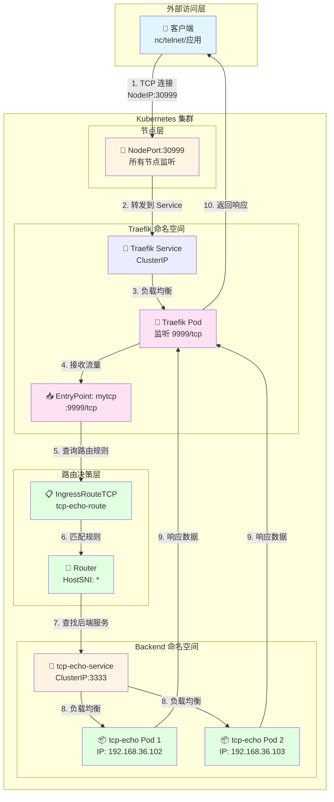
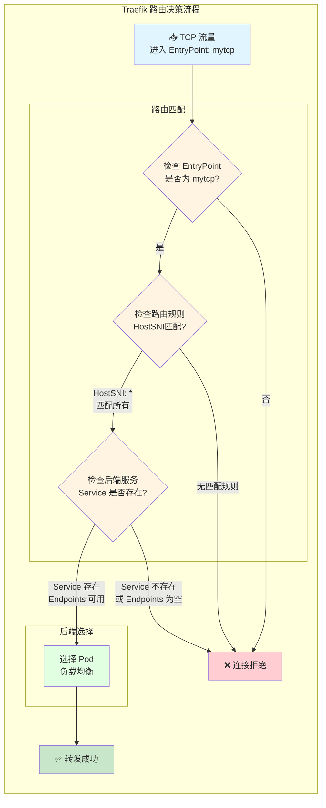
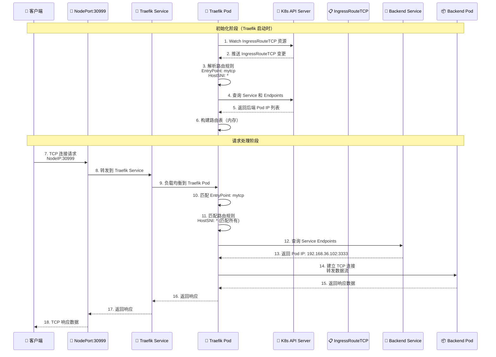
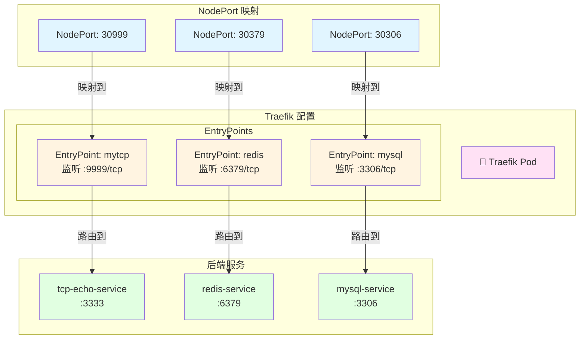

# Kustomize TCP 服务配置指南

**版本**: 1.0  
**日期**: 2025-12-25  
**适用对象**: DevOps 工程师、Kubernetes 管理员

---

## 目录

1. [项目结构标准化](#1-项目结构标准化)
2. [Traefik TCP 架构与原理](#2-traefik-tcp-架构与原理)
3. [Base 层配置详解](#3-base-层配置详解)
4. [Overlay 层配置详解](#4-overlay-层配置详解)
5. [多 TCP 服务架构方案](#5-多-tcp-服务架构方案)
6. [最佳实践](#6-最佳实践)

---

## 1. 项目结构标准化

### 1.1 标准目录结构

为了保持项目结构的高度一致性（Standardization），这是 GitOps 的最佳实践。这样做的好处是：任何人在维护项目时，看到目录结构就知道：`base` 放通用配置，`overlays` 放环境差异化补丁（资源限制、副本数、特定路由规则等）。

**标准结构**:
```
apps/backend/
├── hello-api/
│   ├── base/
│   │   ├── deployment.yaml
│   │   ├── ingress.yaml
│   │   ├── kustomization.yaml
│   │   └── service.yaml
│   └── overlays/
│       └── development/
│           ├── ingress-traefik-patch.yaml
│           ├── kustomization.yaml
│           └── patch-resources.yaml
└── tcp-demo/
    ├── base/
    │   ├── deployment.yaml
    │   ├── ingress-route-tcp.yaml
    │   ├── kustomization.yaml
    │   └── service.yaml
    └── overlays/
        └── development/
            ├── ingress-traefik-patch.yaml
            ├── kustomization.yaml
            └── patch-resources.yaml
```

### 1.2 结构说明

- **Base 层**: 定义"是什么"（这有一个 TCP 路由）
- **Overlay 层**: 定义"怎么用"（开发环境用 mytcp 入口，打上 dev 标签）

---

## 2. Traefik TCP 架构与原理

在深入了解具体的 YAML 配置之前，我们先理解 Traefik TCP 的整体架构和工作原理，这将帮助你更好地理解后续的配置内容。

### 2.1 整体架构图

Traefik TCP 服务的完整架构包含多个层次，从客户端请求到后端 Pod 响应的完整链路如下：



### 2.2 TCP 路由原理图

Traefik TCP 路由的核心在于 EntryPoint 和 IngressRouteTCP 的匹配机制：



**关键点说明**:

1. **EntryPoint 匹配**: Traefik 首先检查流量是否进入正确的 EntryPoint（如 `mytcp`）
2. **路由规则匹配**: 对于纯 TCP（非 TLS），必须使用 `HostSNI('*')` 匹配所有流量
3. **服务发现**: Traefik 通过 Kubernetes API 查询 Service 和 Endpoints
4. **负载均衡**: 如果有多个 Pod，Traefik 会进行负载均衡分发

### 2.3 数据流序列图

完整的 TCP 请求响应流程如下：



### 2.4 HTTP vs TCP 路由对比

为了更好地理解 TCP 路由的特殊性，我们对比 HTTP 和 TCP 路由的区别：

```mermaid
graph TB
    subgraph "HTTP 路由 (Layer 7)"
        HTTPClient[👤 HTTP 客户端]
        HTTPTraefik[🚀 Traefik]
        HTTPRouter{路由决策}
        HTTPRule1[规则1: Host=a.com]
        HTTPRule2[规则2: Host=b.com]
        HTTPSvc1[Service A]
        HTTPSvc2[Service B]
        
        HTTPClient -->|Host: a.com| HTTPTraefik
        HTTPTraefik --> HTTPRouter
        HTTPRouter -->|匹配| HTTPRule1
        HTTPRouter -->|匹配| HTTPRule2
        HTTPRule1 --> HTTPSvc1
        HTTPRule2 --> HTTPSvc2
    end

    subgraph "TCP 路由 (Layer 4)"
        TCPClient[👤 TCP 客户端]
        TCPTraefik[🚀 Traefik]
        TCPEntryPoint1[EntryPoint: mytcp<br/>:9999]
        TCPEntryPoint2[EntryPoint: redis<br/>:6379]
        TCPRouter{路由决策<br/>HostSNI: *}
        TCPSvc1[Service A]
        TCPSvc2[Service B]
        
        TCPClient -->|端口 30999| TCPTraefik
        TCPTraefik --> TCPEntryPoint1
        TCPEntryPoint1 --> TCPRouter
        TCPRouter -->|只能匹配一个| TCPSvc1
        
        TCPClient -.->|端口 30379| TCPTraefik
        TCPTraefik -.-> TCPEntryPoint2
        TCPEntryPoint2 -.-> TCPSvc2
    end

    style HTTPClient fill:#e1f5ff
    style HTTPTraefik fill:#ffe1f5
    style HTTPRouter fill:#fff4e1
    style HTTPSvc1 fill:#e1ffe1
    style HTTPSvc2 fill:#e1ffe1
    
    style TCPClient fill:#e1f5ff
    style TCPTraefik fill:#ffe1f5
    style TCPRouter fill:#fff4e1
    style TCPSvc1 fill:#e1ffe1
    style TCPSvc2 fill:#e1ffe1
```



**关键区别**:

| 特性 | HTTP (Layer 7) | TCP (Layer 4) |
|------|---------------|---------------|
| **端口复用** | ✅ 可以（通过 Host Header） | ❌ 不可以（一个端口一个服务） |
| **路由依据** | Host Header、Path、Header 等 | EntryPoint（端口） |
| **匹配规则** | 精确匹配（如 `Host: a.com`） | 通配符匹配（`HostSNI: *`） |
| **TLS 支持** | 可以读取 SNI 信息 | 纯 TCP 无法读取，TLS 可以 |
| **服务数量** | 一个端口可以服务多个 | 一个端口只能服务一个 |

### 2.5 多 TCP 服务端口分配图

当有多个 TCP 服务时，每个服务需要独立的 EntryPoint 和端口：



**端口分配逻辑**:

1. **NodePort**: 外部访问的端口（如 30999）
2. **EntryPoint**: Traefik 内部监听的端口（如 9999）
3. **Service Port**: 后端服务的端口（如 3333）

每个 TCP 服务都需要这样一套独立的端口映射。

---

## 3. Base 层配置详解

### 3.1 Deployment 配置

**文件**: `apps/backend/tcp-demo/base/deployment.yaml`

```yaml
apiVersion: apps/v1
kind: Deployment
metadata:
  name: tcp-echo-demo
  namespace: backend
  labels:
    app: tcp-echo
spec:
  # [副本数]
  # 这是 Base 的默认值。
  # 在 overlays/development/patch-resources.yaml 中，我们会把它覆盖为 1。
  # 在生产环境可能保留这个 10 或者设置更多。
  replicas: 10

  selector:
    matchLabels:
      app: tcp-echo # 必须匹配 template 里的标签

  template:
    metadata:
      labels:
        app: tcp-echo # 必须匹配 Service 的 selector
    spec:
      containers:
        - name: proxy
          # [核心技巧：镜像占位符]
          # 这里写的不是真实的镜像地址，而是一个逻辑名称。
          # 真实的镜像地址 (newName) 和版本 (newTag) 会在 overlays/*/kustomization.yaml 中
          # 通过 'images' 字段动态替换。
          # 好处：Base 文件与具体镜像仓库解耦。
          image: tcp-echo-server

          ports:
            - containerPort: 3333 # 容器应用实际监听的端口
```

**关键点**:
- **镜像占位符**: `image: tcp-echo-server` 不是真实镜像，而是逻辑名称
- **标签匹配**: Deployment 的 selector 和 template labels 必须一致
- **解耦设计**: Base 层不依赖具体镜像仓库

---

### 3.2 Service 配置

**文件**: `apps/backend/tcp-demo/base/service.yaml`

```yaml
apiVersion: v1
kind: Service
metadata:
  name: tcp-echo-service
  namespace: backend
spec:
  # [服务类型]
  # 这里省略了 type 字段，默认是 ClusterIP。
  # 意味着这个 Service 只能在集群内部访问，外部访问必须通过 Traefik Ingress。

  ports:
    - port: 3333        # [集群内端口] Service 在 ClusterIP 上监听的端口 (Traefik 访问这个)
      targetPort: 3333  # [容器端口] 流量转发给 Pod 里容器实际监听的端口
      name: tcp         # 端口命名，好习惯，方便引用

  # [标签选择器]
  # 只有带有 app=tcp-echo 标签的 Pod 才会成为这个 Service 的后端。
  selector:
    app: tcp-echo
```

**端口映射说明**:
- `port`: Service 在集群内的端口（Traefik 访问这个）
- `targetPort`: Pod 容器实际监听的端口
- `name`: 端口名称，便于引用

---

### 3.3 IngressRouteTCP 配置

**文件**: `apps/backend/tcp-demo/base/ingress-route-tcp.yaml`

```yaml
apiVersion: traefik.io/v1alpha1
kind: IngressRouteTCP # 注意：这是 Traefik 专用的 CRD，专门处理 TCP 流量
metadata:
  name: tcp-echo-route
  namespace: backend
spec:
  # [入口点绑定]
  # 必须对应 Traefik 启动参数 (traefik-app.yaml) 中定义的 entryPoint。
  # 比如: --entrypoints.mytcp.address=:9999/tcp
  entryPoints:
    - mytcp

  routes:
    # [路由匹配规则]
    # HostSNI(`*`) 的含义：
    # 1. 对于 HTTPS (TLS)，Traefik 可以读取 SNI 信息来区分域名 (如 HostSNI(`example.com`))。
    # 2. 对于 纯 TCP (非 TLS)，数据流是黑盒，Traefik 无法看到域名信息。
    # 3. 因此，必须使用通配符 `*`，表示"所有从 mytcp 端口进来的流量，不管发给谁，都无脑转发给后端"。
    - match: HostSNI(`*`)
      services:
        - name: tcp-echo-service # 转发给哪个 Service
          port: 3333             # Service 的端口
```

**关键点**:
- **CRD 资源**: `IngressRouteTCP` 是 Traefik 自定义资源，专门处理 TCP 流量
- **HostSNI(`*`)**: 纯 TCP（非 TLS）必须使用通配符，因为无法读取域名信息
- **EntryPoint**: 必须对应 Traefik 配置中的 entryPoint 名称

---

### 3.4 Kustomization 聚合

**文件**: `apps/backend/tcp-demo/base/kustomization.yaml`

```yaml
apiVersion: kustomize.config.k8s.io/v1beta1
kind: Kustomization

# [资源清单]
# 列出当前目录下所有需要被包含进来的 YAML 文件。
# ArgoCD 或者 'kubectl apply -k' 会读取这个列表并把它们合并成一个流。
resources:
  - deployment.yaml
  - service.yaml
  - ingress-route-tcp.yaml
```

---

## 4. Overlay 层配置详解

### 4.1 资源限制补丁

**文件**: `apps/backend/tcp-demo/overlays/development/patch-resources.yaml`

```yaml
# -----------------------------------------------------------------
# 文件名: apps/backend/tcp-demo/overlays/development/patch-resources.yaml
# 作用: 针对 Development 环境的差异化补丁 (Patch)
# -----------------------------------------------------------------
apiVersion: apps/v1
kind: Deployment
metadata:
  # [关键] Kustomize 依靠这个名字去 base 里找"受害者"
  # 必须和 base/deployment.yaml 里的名字完全一致
  name: tcp-echo-demo

  # 指定命名空间，通常在 kustomization.yaml 里也会统一指定，这里写上也无妨
  namespace: backend

spec:
  # [差异化配置] 副本数
  # 开发环境为了省钱省资源，通常设为 1。
  # 生产环境 (Production) 可能会设为 3 以实现高可用。
  replicas: 1

  template:
    spec:
      containers:
        # [关键] 容器名字
        # Kustomize 需要通过这个名字知道你要修改列表里的哪一个容器。
        # 必须和 base/deployment.yaml 里的 container name 一致 (即 "proxy")。
        - name: proxy

          # [核心修改] 资源配额 (Resource Quotas)
          # 这通常是开发环境和生产环境最大的区别之一。
          resources:

            # 1. Requests (请求值/下限)
            # 含义：Pod 启动时的"最低消费"。
            # 作用：K8s 调度器会寻找剩余资源满足这些要求的节点。如果节点资源不够，Pod 就会 Pending。
            requests:
              # 64 Mebibytes (约等于 67MB)。
              # 注意：Mi 是二进制单位 (1024*1024)，M 是十进制单位 (1000*1000)。K8s 推荐用 Mi。
              memory: "64Mi"

              # 50 millicores (50 毫核)，即 0.05 个 CPU 核心。
              # 1000m = 1 核。50m 是非常小的 CPU 需求，适合开发环境闲置。
              cpu: "50m"

            # 2. Limits (限制值/上限)
            # 含义：Pod 运行时的"最高消费"。
            # 作用：防止应用内存泄漏或 CPU 跑死循环把整个节点搞挂。
            limits:
              # 如果容器使用的内存超过 128Mi，它会被 OOMKilled (Out Of Memory Killed) 重启。
              # 这里的限制比较紧，如果你的 TCP 应用处理大量并发，可能需要调大。
              memory: "128Mi"

              # 如果容器尝试使用超过 100m (0.1 核) 的 CPU，它会被操作系统限流 (Throttling)，变慢但不会死。
              cpu: "100m"
```

**补丁原理**:
- 这不是完整的 Deployment，而是告诉 Kustomize："找到那个叫 `tcp-echo-demo` 的 Deployment，只修改我列出来的这些字段，其他保持原样。"
- 为什么不写 `image` 字段？因为 `image` 已经在 base 里定义了，Kustomize 会合并这两个文件。

---

### 4.2 TCP 路由补丁

**文件**: `apps/backend/tcp-demo/overlays/development/ingress-traefik-patch.yaml`

```yaml
# -----------------------------------------------------------------
# 文件名: apps/backend/tcp-demo/overlays/development/ingress-traefik-patch.yaml
# 作用: 专门修补 IngressRouteTCP 的配置
# -----------------------------------------------------------------
# [类型声明]
# 必须完全匹配 base 文件里的定义，否则 Kustomize 找不到要修补的对象。
apiVersion: traefik.io/v1alpha1
kind: IngressRouteTCP

metadata:
  # [定位锚点]
  # Kustomize 通过这里的 name 知道你要修改 base 里的哪个资源。
  name: tcp-echo-route
  namespace: backend

  # [Annotations 注解]
  # 这里演示了如何给资源添加额外的元数据。
  # 场景举例：有些监控工具或外部 DNS 插件依赖 annotations 来工作。
  # 下面这一行其实是 Traefik 的一种元数据标记，明确指出该路由属于 mytcp 入口点。
  annotations:
    traefik.ingress.kubernetes.io/router.entrypoints: mytcp

spec:
  # [EntryPoints 入口点]
  # 这是 Traefik 路由的核心。
  # "mytcp" 必须对应你在 traefik-app.yaml (Helm values) 中配置的
  # --entrypoints.mytcp.address=:9999/tcp
  #
  # 为什么要在补丁里写这个？
  # 1. 显式声明：再次确认开发环境走这个入口。
  # 2. 环境隔离：假如生产环境的入口点叫 "prodtcp" (监听不同端口)，
  #    你就可以在 overlays/production 里的补丁把这里改成 "prodtcp"。
  entryPoints:
    - mytcp
```

---

### 4.3 Kustomization 总指挥

**文件**: `apps/backend/tcp-demo/overlays/development/kustomization.yaml`

```yaml
# -----------------------------------------------------------------
# 文件名: apps/backend/tcp-demo/overlays/development/kustomization.yaml
# 作用: 定义 Development 环境的最终形态
# -----------------------------------------------------------------
apiVersion: kustomize.config.k8s.io/v1beta1
kind: Kustomization

# [资源引用]
# 这里的 ../../base 指向了该应用的基础定义目录。
# Kustomize 会先读取 base 里的 Deployment, Service, IngressRouteTCP，
# 把它们当作"原材料"。
resources:
  - ../../base

# [统一标签管理] (Kustomize v5+ 新语法)
# 作用：给当前环境下的所有资源（包括 Service 的 selector, Deployment 的 Pod template）
# 自动打上这些标签。
# 好处：以后你可以通过 kubectl get all -l environment=development 一键查询开发环境所有资源。
labels:
  - pairs:
      environment: development
      project: ic2

# [补丁列表]
# 这是 Kustomize 最强大的功能：在不修改 base 文件的前提下，修改特定配置。
patches:
  # 1. 针对 Deployment 的补丁
  # 这个文件里定义了 replicas: 1 和 CPU/内存限制。
  - path: patch-resources.yaml
    target:
      kind: Deployment
      name: tcp-echo-demo

  # 2. 针对 Traefik IngressRouteTCP 的补丁
  # 这个文件里定义了路由规则的微调。
  - path: ingress-traefik-patch.yaml
    target:
      # [CRD 关键点！！！]
      # 对于 Kubernetes 原生资源 (如 Deployment, Service)，只写 kind 和 name 就够了。
      # 但是！对于 CRD (自定义资源)，如 Traefik 的 IngressRouteTCP，
      # Kustomize 有时会找不到它，所以必须显式指定 group 和 version。
      group: traefik.io      # 对应 apiVersion 的斜杠前部分
      version: v1alpha1       # 对应 apiVersion 的斜杠后部分
      kind: IngressRouteTCP
      name: tcp-echo-route

# [镜像替换策略]
# 这是 Kustomize 中一种非常高级且优雅的用法："占位符模式"（Placeholder Pattern）。
# 
# 为什么这样做很棒？
# 1. 解耦 (Decoupling): Base 不需要知道真实的镜像仓库地址（比如是 DockerHub 还是阿里云）。
#    它只用一个逻辑名称 tcp-echo-server 来代表"这里需要一个 TCP Echo 的镜像"。
# 2. 灵活性 (Flexibility):
#    - Development 环境：可以将 tcp-echo-server 替换为 iceymoss/tcp-echo:dev
#    - Production 环境：可以将 tcp-echo-server 替换为 registry.company.com/stable/tcp-echo:v1.0.0
# 3. Base 层：永远保持干净，没有任何特定的镜像仓库依赖。
images:
  - name: tcp-echo-server    # [重点] 这里必须填 Base 里原本写的那个镜像占位符名称！
    newName: iceymoss/tcp-echo # 替换对应的镜像仓库和名称
    newTag: "1.0"             # 替换 Tag
```

**关键知识点**:

1. **Patches 的 target 写法**:
   - **普通资源**（Deployment/Service）：写 `kind` + `name` 即可
   - **CRD 资源**（Traefik/CertManager/Prometheus）：保险起见，一定要写全 `group` + `version` + `kind` + `name`

2. **镜像替换逻辑**:
   - `name`: 必须填 Base 里原本写的镜像占位符名称（如 `tcp-echo-server`），不是容器名
   - `newName`: 替换成新的镜像仓库和名称
   - `newTag`: 替换成新的标签

3. **替换流程**:
   ```
   Base: image: tcp-echo-server
   ↓
   Overlay: name: tcp-echo-server, newName: iceymoss/tcp-echo, newTag: "1.0"
   ↓
   最终: image: iceymoss/tcp-echo:1.0
   ```

---

## 5. 多 TCP 服务架构方案

### 5.1 问题背景

当你在 `apps/backend` 下除了 `tcp-demo`，还有多个 TCP 服务时，应该如何配置？

**核心问题**: 对于纯 TCP（非 TLS 加密）的服务，你无法在同一个端口（比如 30999）上运行多个不同的服务。

### 5.2 HTTP vs TCP 路由区别

#### HTTP (Layer 7) - 可以共用端口

- 流量里包含 `Host Header`（比如 `Host: a.com` 和 `Host: b.com`）
- Traefik 读取这个 Header，然后像邮递员一样把信分发给不同的人
- **结论**: 成千上万个 Web 服务可以共用一个 80 端口

#### 纯 TCP (Layer 4) - 无法共用端口

- 流量就是一堆二进制数据流，没有 Header
- Traefik 就像面对两个蒙面人，完全不知道谁是谁
- 所以在配置里我们被迫写了 `HostSNI('*')`（意思是：只要是这个端口进来的，不管是谁，全送走）
- **结论**: 一个端口只能被一个服务独占

### 5.3 解决方案 A：多端口策略（推荐）

这是最常用、最推荐的方案。如果你要加一个 Redis 服务，你需要在 Traefik 上再开一扇门。

#### 5.3.1 配置示例

假设：
- `tcp-demo` 用 `30999` (NodePort) -> `9999` (Traefik)
- `redis-demo` 用 `30379` (NodePort) -> `6379` (Traefik)

**修改 Traefik 配置** (`argocd-bootstrap/ingress-controller/traefik-app.yaml`):

```yaml
apiVersion: argoproj.io/v1alpha1
kind: Application
metadata:
  name: traefik-ingress
  namespace: argocd
spec:
  project: default
  source:
    chart: traefik
    repoURL: https://traefik.github.io/charts
    targetRevision: 26.0.0
    helm:
      values: |
        # ... 其他配置 ...

        # 1. 增加新的监听端口 (EntryPoint)
        additionalArguments:
          - "--accesslog=true"
          - "--accesslog.format=json"
          - "--entrypoints.mytcp.address=:9999/tcp"  # 旧的 tcp-demo
          - "--entrypoints.redis.address=:6379/tcp"   # 【新增】给 Redis 开个门

        # ... 

        # 2. 暴露新的 NodePort
        service:
          type: NodePort
        ports:
          # ... web/websecure ...

          # 旧的 tcp-demo
          mytcp:
            port: 9999
            expose: true
            exposedPort: 9999
            protocol: TCP
            nodePort: 30999

          # 【新增】Redis 专用端口
          redis:
            port: 6379
            expose: true
            exposedPort: 6379
            protocol: TCP
            nodePort: 30379   # 外网通过这个端口访问 Redis
```

#### 5.3.2 对应的 IngressRouteTCP 配置

**Redis 服务的 IngressRouteTCP** (`apps/backend/redis-demo/base/ingress-route-tcp.yaml`):

```yaml
apiVersion: traefik.io/v1alpha1
kind: IngressRouteTCP
metadata:
  name: redis-route
  namespace: backend
spec:
  entryPoints:
    - redis  # <--- 绑定到新开的入口
  routes:
    - match: HostSNI(`*`)
      services:
        - name: redis-service
          port: 6379
```

### 5.4 解决方案 B：TLS SNI 多路复用（高级用法）

如果你的 TCP 服务支持 TLS 加密（即客户端和服务器通过 SSL 握手），那么 Traefik 可以通过 SNI (Server Name Indication) 来区分流量。

这种情况下，你可以让多个 TCP 服务共用同一个端口（通常复用 443）。

#### 5.4.1 使用条件

- 客户端连接时必须使用 TLS
- 客户端必须发送 SNI 域名（比如 `db.example.com`）

#### 5.4.2 配置示例

**TCP 服务 A (DB)**:

```yaml
apiVersion: traefik.io/v1alpha1
kind: IngressRouteTCP
metadata:
  name: db-route
  namespace: backend
spec:
  entryPoints:
    - websecure  # 复用 443 端口
  routes:
    - match: HostSNI(`db.example.com`) # <--- 靠域名区分！
      services:
        - name: db-service
          port: 5432
  tls: # 必须开启 TLS
    passthrough: true # 或者 terminate
```

**TCP 服务 B (Cache)**:

```yaml
apiVersion: traefik.io/v1alpha1
kind: IngressRouteTCP
metadata:
  name: cache-route
  namespace: backend
spec:
  entryPoints:
    - websecure # 也是 443 端口
  routes:
    - match: HostSNI(`cache.example.com`) # <--- 靠域名区分！
      services:
        - name: cache-service
          port: 6379
  tls:
    passthrough: true
```

### 5.5 方案选择建议

| 场景 | 推荐方案 | 原因 |
|------|---------|------|
| 内部 TCP 服务（数据库、中间件、自定义 TCP 协议） | 方案 A（多端口策略） | 最稳定，不要求客户端修改代码支持 TLS |
| Go 程序（echo-server）没有写 TLS 握手逻辑 | 方案 A | 简单直接，无需处理证书 |
| MySQL, Redis, MongoDB 等内网服务 | 方案 A | 通常在内网跑，不需要加密 |
| TCP 服务暴露到公网，且必须加密 | 方案 B | 安全性要求 |
| 端口资源极其紧张（防火墙只开了 443） | 方案 B | 端口限制 |

**总结**: 对于绝大多数内部 TCP 服务，请使用方案 A（多端口策略）。虽然需要多开端口，但它最稳定，不要求客户端修改代码支持 TLS，也不需要处理复杂的证书问题。

---

## 6. 最佳实践

### 6.1 目录结构规范

- **Base 层**: 只包含通用配置，不包含环境特定信息
- **Overlay 层**: 包含环境差异化配置（资源限制、副本数、镜像标签等）
- **命名规范**: 保持与 `hello-api` 等 HTTP 服务一致的结构

### 6.2 镜像管理

- **占位符模式**: Base 中使用逻辑名称（如 `tcp-echo-server`）
- **环境隔离**: 不同环境使用不同的镜像标签
- **解耦设计**: Base 层不依赖具体镜像仓库

### 6.3 资源限制

- **开发环境**: 设置较小的 Limits，防止 Bug 代码吃光集群资源
- **生产环境**: Requests 设置得高一点（预留足够资源），Limits 也会放宽
- **QoS 等级**: 生产环境可以让 Requests == Limits (QoS Class: Guaranteed) 来获得最高的稳定性

### 6.4 TCP 路由配置

- **EntryPoint 命名**: 使用有意义的名称（如 `mytcp`, `redis`, `mysql`）
- **端口规划**: 提前规划好端口分配，避免冲突
- **文档记录**: 在文档中记录每个 TCP 服务使用的端口和 EntryPoint

### 6.5 多服务管理

- **端口分配表**: 维护一个端口分配表，记录每个服务使用的端口
- **统一配置**: 在 Traefik 配置中统一管理所有 EntryPoint
- **命名规范**: 使用一致的命名规范（如 `{service-name}-route`）

---

## 附录

### A. 端口分配示例表

| 服务名称 | EntryPoint | Traefik 端口 | NodePort | 用途 |
|---------|-----------|-------------|----------|------|
| tcp-demo | mytcp | 9999 | 30999 | TCP Echo 服务 |
| redis-demo | redis | 6379 | 30379 | Redis 服务 |
| mysql-demo | mysql | 3306 | 30306 | MySQL 服务 |

### B. 常用命令

```bash
# 查看所有 IngressRouteTCP
kubectl get ingressroutetcp -A

# 查看 Traefik EntryPoints
kubectl logs -n traefik -l app.kubernetes.io/name=traefik | grep entrypoint

# 测试 TCP 连接
nc -zv <NodeIP> <NodePort>

# 查看 Service Endpoints
kubectl get endpoints -n backend
```

### C. 参考资源

- [Kustomize 官方文档](https://kustomize.io/)
- [Traefik IngressRouteTCP 文档](https://doc.traefik.io/traefik/routing/providers/kubernetes-crd/#kind-ingressroutetcp)
- [Kubernetes Service 文档](https://kubernetes.io/docs/concepts/services-networking/service/)

---

**文档维护**: 本文档应随项目配置更新及时更新。  
**最后更新**: 2025-12-25

