# Kustomize UDP Service Configuration Guide

**Version**: 1.0  
**Date**: 2025-12-25  
**Target Audience**: DevOps Engineers, Kubernetes Administrators

---

## Table of Contents

1. [Project Structure Standardization](#1-project-structure-standardization)
2. [UDP vs TCP: Key Differences](#2-udp-vs-tcp-key-differences)
3. [Traefik UDP Architecture and Principles](#3-traefik-udp-architecture-and-principles)
4. [Base Layer Configuration Details](#4-base-layer-configuration-details)
5. [Overlay Layer Configuration Details](#5-overlay-layer-configuration-details)
6. [Application Development](#6-application-development)
7. [Testing and Verification](#7-testing-and-verification)
8. [Best Practices](#8-best-practices)

---

## 1. Project Structure Standardization

### 1.1 Standard Directory Structure

Following the same GitOps best practices as TCP services, the UDP service structure is:

```
apps/backend/udp-demo/
├── base/
│   ├── deployment.yaml
│   ├── service.yaml
│   ├── ingress-route-udp.yaml
│   └── kustomization.yaml
└── overlays/
    └── development/
        ├── ingress-traefik-patch.yaml
        ├── patch-resources.yaml
        └── kustomization.yaml
```

### 1.2 Structure Description

- **Base Layer**: Defines "what it is" (a UDP route)
- **Overlay Layer**: Defines "how to use it" (development environment uses myudp entry point, with dev labels)

---

## 2. UDP vs TCP: Key Differences

### 2.1 Protocol Characteristics

| Feature | TCP | UDP |
|---------|-----|-----|
| **Connection** | Connection-oriented (handshake required) | Connectionless (no handshake) |
| **Reliability** | Reliable (guaranteed delivery) | Unreliable (best effort) |
| **Ordering** | Ordered delivery | No ordering guarantee |
| **Speed** | Slower (overhead for reliability) | Faster (minimal overhead) |
| **Use Cases** | HTTP, HTTPS, Database connections | DNS, Gaming, Streaming, Real-time data |

### 2.2 Kubernetes Configuration Differences

| Configuration | TCP | UDP |
|---------------|-----|-----|
| **Service Protocol** | `protocol: TCP` (default) | `protocol: UDP` (must specify) |
| **Container Port** | `protocol: TCP` (default) | `protocol: UDP` (must specify) |
| **Traefik EntryPoint** | `:9999/tcp` | `:9998/udp` |
| **Traefik CRD** | `IngressRouteTCP` | `IngressRouteUDP` |
| **Route Matching** | `HostSNI('*')` required | No matching needed (direct forwarding) |

### 2.3 Application Code Differences

**TCP (Connection-oriented)**:
```go
// TCP requires connection establishment
conn, err := net.Dial("tcp", "host:port")
conn.Write(data)
conn.Read(buffer)
```

**UDP (Connectionless)**:
```go
// UDP uses datagram sockets
conn, err := net.ListenUDP("udp", addr)
conn.ReadFromUDP(buffer)  // Receives from any source
conn.WriteToUDP(data, addr)  // Sends to specific address
```

---

## 3. Traefik UDP Architecture and Principles

### 3.1 Overall Architecture Diagram

The complete architecture of Traefik UDP services:


### 3.2 UDP Routing Principle Diagram

UDP routing in Traefik is simpler than TCP because there's no connection state:


**Key Points**:

1. **No Connection State**: UDP is connectionless, each datagram is independent
2. **No Matching Rules**: Unlike TCP's `HostSNI`, UDP routes directly forward all traffic
3. **Service Discovery**: Traefik queries Service and Endpoints through Kubernetes API
4. **Load Balancing**: If there are multiple Pods, Traefik performs load balancing per datagram

### 3.3 Data Flow Sequence Diagram

The complete UDP request-response flow:

```mermaid
sequenceDiagram
    participant Client as 👤 UDP Client
    participant NodePort as 🔌 NodePort:30998
    participant TraefikSvc as 🔌 Traefik Service
    participant TraefikPod as 🚀 Traefik Pod
    participant K8sAPI as 🧠 K8s API Server
    participant IngressRouteUDP as 📋 IngressRouteUDP
    participant BackendSvc as 🔌 Backend Service
    participant BackendPod as 📦 Backend Pod

    Note over Client,BackendPod: Initialization Phase (When Traefik Starts)
    TraefikPod->>K8sAPI: 1. Watch IngressRouteUDP Resources
    K8sAPI-->>TraefikPod: 2. Push IngressRouteUDP Changes
    TraefikPod->>TraefikPod: 3. Parse Routing Rules<br/>EntryPoint: myudp
    TraefikPod->>K8sAPI: 4. Query Service and Endpoints
    K8sAPI-->>TraefikPod: 5. Return Backend Pod IP List
    TraefikPod->>TraefikPod: 6. Build Routing Table (In Memory)

    Note over Client,BackendPod: Request Processing Phase (Per Datagram)
    Client->>NodePort: 7. UDP Datagram<br/>NodeIP:30998<br/>Data: "hello udp"
    NodePort->>TraefikSvc: 8. Forward to Traefik Service
    TraefikSvc->>TraefikPod: 9. Load Balance to Traefik Pod
    TraefikPod->>TraefikPod: 10. Match EntryPoint: myudp
    TraefikPod->>TraefikPod: 11. Match Routing Rules<br/>(Direct Forward)
    TraefikPod->>BackendSvc: 12. Query Service Endpoints
    BackendSvc-->>TraefikPod: 13. Return Pod IP: 192.168.36.104:4444
    TraefikPod->>BackendPod: 14. Forward UDP Datagram<br/>Data: "hello udp"
    BackendPod->>BackendPod: 15. Process Datagram<br/>Echo Response
    BackendPod-->>TraefikPod: 16. Return UDP Response<br/>Data: "hello udp"
    TraefikPod-->>TraefikSvc: 17. Return Response
    TraefikSvc-->>NodePort: 18. Return Response
    NodePort-->>Client: 19. UDP Response Datagram
```



### 3.4 TCP vs UDP Routing Comparison

```mermaid
graph TB
    subgraph "TCP Routing (Connection-oriented)"
        TCPClient[👤 TCP Client]
        TCPTraefik[🚀 Traefik]
        TCPEntryPoint[EntryPoint: mytcp<br/>:9999/tcp]
        TCPRouter{Routing Decision<br/>HostSNI: *}
        TCPSvc[Service]
        
        TCPClient -->|1. TCP Connection| TCPTraefik
        TCPTraefik --> TCPEntryPoint
        TCPEntryPoint --> TCPRouter
        TCPRouter -->|2. Match Rule| TCPSvc
        TCPSvc -->|3. Maintain Connection| TCPClient
    end

    subgraph "UDP Routing (Connectionless)"
        UDPClient[👤 UDP Client]
        UDPTraefik[🚀 Traefik]
        UDPEntryPoint[EntryPoint: myudp<br/>:9998/udp]
        UDPRouter{Direct Forward<br/>No Matching}
        UDPSvc[Service]
        
        UDPClient -->|1. UDP Datagram| UDPTraefik
        UDPTraefik --> UDPEntryPoint
        UDPEntryPoint --> UDPRouter
        UDPRouter -->|2. Direct Forward| UDPSvc
        UDPSvc -->|3. Response Datagram| UDPClient
    end

    style TCPClient fill:#e1f5ff
    style TCPTraefik fill:#ffe1f5
    style TCPRouter fill:#fff4e1
    style TCPSvc fill:#e1ffe1
    
    style UDPClient fill:#e1f5ff
    style UDPTraefik fill:#ffe1f5
    style UDPRouter fill:#fff4e1
    style UDPSvc fill:#e1ffe1
```



**Key Differences**:

| Aspect | TCP | UDP |
|--------|-----|-----|
| **Connection** | Maintains connection state | Stateless, per-datagram |
| **Route Matching** | Requires `HostSNI('*')` | No matching, direct forward |
| **EntryPoint Format** | `:9999/tcp` | `:9998/udp` |
| **CRD Type** | `IngressRouteTCP` | `IngressRouteUDP` |
| **Route Configuration** | Must specify `match` field | No `match` field needed |

---

## 4. Base Layer Configuration Details

### 4.1 Deployment Configuration

**File**: `apps/backend/udp-demo/base/deployment.yaml`

```yaml
apiVersion: apps/v1
kind: Deployment
metadata:
  name: udp-echo-demo
  namespace: backend
  labels:
    app: udp-echo
spec:
  # [Replica Count]
  # This is the Base default value.
  # In overlays/development/patch-resources.yaml, we'll override it to 1.
  # Production environment may keep this 10 or set more.
  replicas: 10

  selector:
    matchLabels:
      app: udp-echo # Must match template labels

  template:
    metadata:
      labels:
        app: udp-echo # Must match Service selector
    spec:
      containers:
        - name: proxy
          # [Core Technique: Image Placeholder]
          # This is not a real image address, but a logical name.
          # The real image address (newName) and version (newTag) will be dynamically replaced
          # in overlays/*/kustomization.yaml through the 'images' field.
          # Benefit: Base files are decoupled from specific image registries.
          image: udp-echo-server

          ports:
            - containerPort: 4444
              protocol: UDP  # ⚠️ [Critical] Must specify UDP protocol
```

**Key Points**:
- **Image Placeholder**: `image: udp-echo-server` is a logical name, not a real image
- **Protocol Declaration**: `protocol: UDP` is required for UDP services
- **Label Matching**: Deployment selector and template labels must match

---

### 4.2 Service Configuration

**File**: `apps/backend/udp-demo/base/service.yaml`

```yaml
apiVersion: v1
kind: Service
metadata:
  name: udp-echo-service
  namespace: backend
spec:
  # [Service Type]
  # The type field is omitted here, default is ClusterIP.
  # This means the Service can only be accessed within the cluster,
  # external access must go through Traefik Ingress.

  ports:
    - port: 4444        # [Cluster Port] Port the Service listens on (Traefik accesses this)
      targetPort: 4444  # [Container Port] Port the Pod container actually listens on
      protocol: UDP     # ⚠️ [Critical] Protocol declaration, this line cannot be omitted
      name: udp         # Port naming, good practice for easy reference

  # [Label Selector]
  # Only Pods with app=udp-echo label will become backends for this Service.
  selector:
    app: udp-echo
```

**Port Mapping Explanation**:
- `port`: Port the Service listens on within the cluster (Traefik accesses this)
- `targetPort`: Port the Pod container actually listens on
- `protocol: UDP`: **Critical** - Must specify UDP protocol
- `name`: Port name for easy reference

---

### 4.3 IngressRouteUDP Configuration

**File**: `apps/backend/udp-demo/base/ingress-route-udp.yaml`

```yaml
apiVersion: traefik.io/v1alpha1
kind: IngressRouteUDP  # ⚠️ Note: This is Traefik's dedicated CRD for UDP traffic
metadata:
  name: udp-echo-route
  namespace: backend
spec:
  # [Entry Point Binding]
  # Must correspond to the entryPoint defined in Traefik startup parameters (traefik-app.yaml).
  # For example: --entrypoints.myudp.address=:9998/udp
  entryPoints:
    - myudp

  routes:
    # [Routing Rules]
    # UDP does not need match rules (no HostSNI), it directly forwards all traffic
    # from the entry point to the Service.
    # Unlike TCP which requires HostSNI('*'), UDP routes are simpler.
    - services:
        - name: udp-echo-service  # Which Service to forward to
          port: 4444               # Service port
```

**Key Points**:
- **CRD Resource**: `IngressRouteUDP` is Traefik's custom resource, specifically for UDP traffic
- **No Match Field**: UDP routes don't need a `match` field (unlike TCP's `HostSNI`)
- **Direct Forwarding**: All traffic from the entry point is forwarded directly to the Service
- **EntryPoint**: Must correspond to the entryPoint name in Traefik configuration

---

### 4.4 Kustomization Aggregation

**File**: `apps/backend/udp-demo/base/kustomization.yaml`

```yaml
apiVersion: kustomize.config.k8s.io/v1beta1
kind: Kustomization

# [Resource List]
# Lists all YAML files in the current directory that need to be included.
# ArgoCD or 'kubectl apply -k' will read this list and merge them into a stream.
resources:
  - deployment.yaml
  - service.yaml
  - ingress-route-udp.yaml
```

---

## 5. Overlay Layer Configuration Details

### 5.1 Resource Limit Patch

**File**: `apps/backend/udp-demo/overlays/development/patch-resources.yaml`

```yaml
# -----------------------------------------------------------------
# File: apps/backend/udp-demo/overlays/development/patch-resources.yaml
# Purpose: Environment-specific patch for Development environment
# -----------------------------------------------------------------
apiVersion: apps/v1
kind: Deployment
metadata:
  # [Key] Kustomize relies on this name to find the "target" in base
  # Must exactly match the name in base/deployment.yaml
  name: udp-echo-demo

  # Specify namespace, usually also specified in kustomization.yaml, but it's fine to include here
  namespace: backend

spec:
  # [Environment-specific Configuration] Replica Count
  # Development environment typically uses 1 to save resources.
  # Production environment might use 3 for high availability.
  replicas: 1

  template:
    spec:
      containers:
        # [Key] Container name
        # Kustomize needs this name to know which container in the list to modify.
        # Must match the container name in base/deployment.yaml (i.e., "proxy").
        - name: proxy

          # [Core Modification] Resource Quotas
          # This is usually one of the biggest differences between dev and prod environments.
          resources:

            # 1. Requests (Lower Limit)
            # Meaning: "Minimum consumption" when Pod starts.
            # Function: K8s scheduler will find nodes with remaining resources meeting these requirements.
            # If node resources are insufficient, Pod will be Pending.
            requests:
              # 64 Mebibytes (approximately 67MB).
              # Note: Mi is binary unit (1024*1024), M is decimal unit (1000*1000). K8s recommends Mi.
              memory: "64Mi"

              # 50 millicores (50 millicores), i.e., 0.05 CPU cores.
              # 1000m = 1 core. 50m is a very small CPU requirement, suitable for idle dev environments.
              cpu: "50m"

            # 2. Limits (Upper Limit)
            # Meaning: "Maximum consumption" when Pod runs.
            # Function: Prevents application memory leaks or CPU infinite loops from crashing the node.
            limits:
              # If container uses more than 128Mi memory, it will be OOMKilled (Out Of Memory Killed) and restarted.
              # This limit is relatively tight, if your UDP application handles high concurrency, may need to increase.
              memory: "128Mi"

              # If container tries to use more than 100m (0.1 core) CPU, it will be throttled by OS, slow but won't die.
              cpu: "100m"
```

**Patch Principle**:
- This is not a complete Deployment, but tells Kustomize: "Find the Deployment named `udp-echo-demo`, only modify the fields I list, keep others unchanged."
- Why not write `image` field? Because `image` is already defined in base, Kustomize will merge these two files.

---

### 5.2 UDP Route Patch

**File**: `apps/backend/udp-demo/overlays/development/ingress-traefik-patch.yaml`

```yaml
# -----------------------------------------------------------------
# File: apps/backend/udp-demo/overlays/development/ingress-traefik-patch.yaml
# Purpose: Specifically patches IngressRouteUDP configuration
# -----------------------------------------------------------------
# [Type Declaration]
# Must exactly match the definition in base file, otherwise Kustomize won't find the target to patch.
apiVersion: traefik.io/v1alpha1
kind: IngressRouteUDP  # ⚠️ Must match Base's Kind

metadata:
  # [Location Anchor]
  # Kustomize uses the name here to know which resource in base to modify.
  name: udp-echo-route
  namespace: backend

  # [Annotations]
  # Demonstrates how to add additional metadata to resources.
  # Use case examples: Some monitoring tools or external DNS plugins depend on annotations.
  # The line below is actually a Traefik metadata marker, explicitly indicating this route belongs to myudp entry point.
  annotations:
    traefik.ingress.kubernetes.io/router.entrypoints: myudp

spec:
  # [EntryPoints]
  # This is the core of Traefik routing.
  # "myudp" must correspond to what you configured in traefik-app.yaml (Helm values)
  # --entrypoints.myudp.address=:9998/udp
  #
  # Why write this in the patch?
  # 1. Explicit declaration: Confirm again that dev environment uses this entry.
  # 2. Environment isolation: If production environment's entry point is called "produp" (listening on different port),
  #    you can change this to "produp" in overlays/production patch.
  entryPoints:
    - myudp
```

---

### 5.3 Kustomization Master

**File**: `apps/backend/udp-demo/overlays/development/kustomization.yaml`

```yaml
# -----------------------------------------------------------------
# File: apps/backend/udp-demo/overlays/development/kustomization.yaml
# Purpose: Define the final form of Development environment
# -----------------------------------------------------------------
apiVersion: kustomize.config.k8s.io/v1beta1
kind: Kustomization

# [Resource Reference]
# The ../../base here points to the base definition directory of this application.
# Kustomize will first read Deployment, Service, IngressRouteUDP from base,
# treating them as "raw materials".
resources:
  - ../../base

# [Unified Label Management] (Kustomize v5+ new syntax)
# Function: Automatically add these labels to all resources in current environment
# (including Service selectors, Deployment Pod templates).
# Benefit: You can query all dev environment resources with one command:
# kubectl get all -l environment=development
labels:
  - pairs:
      environment: development
      project: ic2

# [Patch List]
# This is Kustomize's most powerful feature: modify specific configurations without changing base files.
patches:
  # 1. Patch for Deployment
  # This file defines replicas: 1 and CPU/memory limits.
  - path: patch-resources.yaml
    target:
      kind: Deployment
      name: udp-echo-demo

  # 2. Patch for Traefik IngressRouteUDP
  # This file defines routing rule adjustments.
  - path: ingress-traefik-patch.yaml
    target:
      # [CRD Critical Point!!!]
      # For Kubernetes native resources (like Deployment, Service), just write kind and name.
      # But! For CRD (Custom Resources), like Traefik's IngressRouteUDP,
      # Kustomize sometimes can't find it, so must explicitly specify group and version.
      group: traefik.io      # Corresponds to the part before slash in apiVersion
      version: v1alpha1      # Corresponds to the part after slash in apiVersion
      kind: IngressRouteUDP   # ⚠️ Must be accurate
      name: udp-echo-route

# [Image Replacement Strategy]
# This is a very advanced and elegant usage in Kustomize: "Placeholder Pattern".
# 
# Why is this great?
# 1. Decoupling: Base doesn't need to know real image registry addresses (like DockerHub or Aliyun).
#    It only uses a logical name udp-echo-server to represent "an UDP Echo image is needed here".
# 2. Flexibility:
#    - Development environment: Can replace udp-echo-server with iceymoss/udp-echo:dev
#    - Production environment: Can replace udp-echo-server with registry.company.com/stable/udp-echo:v1.0.0
# 3. Base layer: Always stays clean, no specific image registry dependencies.
images:
  - name: udp-echo-server    # [Key] Must fill the image placeholder name written in Base!
    newName: iceymoss/udp-echo # Replace with corresponding image registry and name
    newTag: "1.0"             # Replace Tag
```

**Key Knowledge Points**:

1. **Patches target syntax**:
   - **Normal resources** (Deployment/Service): Just write `kind` + `name`
   - **CRD resources** (Traefik/CertManager/Prometheus): To be safe, must write full `group` + `version` + `kind` + `name`

2. **Image replacement logic**:
   - `name`: Must fill the image placeholder name written in Base (e.g., `udp-echo-server`), not container name
   - `newName`: Replace with new image registry and name
   - `newTag`: Replace with new tag

3. **Replacement flow**:
   ```
   Base: image: udp-echo-server
   ↓
   Overlay: name: udp-echo-server, newName: iceymoss/udp-echo, newTag: "1.0"
   ↓
   Final: image: iceymoss/udp-echo:1.0
   ```

---

## 6. Application Development

### 6.1 Go UDP Server Implementation

**File**: `main.go`

```go
package main

import (
	"fmt"
	"net"
	"os"
)

func main() {
	// Listen on container's 4444 port (UDP)
	port := ":4444"
	addr, err := net.ResolveUDPAddr("udp", port)
	if err != nil {
		fmt.Println("Error resolving address:", err)
		os.Exit(1)
	}

	// Establish UDP listener
	conn, err := net.ListenUDP("udp", addr)
	if err != nil {
		fmt.Println("Error listening:", err)
		os.Exit(1)
	}
	defer conn.Close()

	fmt.Printf("UDP Echo Server listening on %s\n", port)
	buffer := make([]byte, 1024)

	for {
		// Read data
		n, remoteAddr, err := conn.ReadFromUDP(buffer)
		if err != nil {
			fmt.Println("Error reading:", err)
			continue
		}

		fmt.Printf("Received %d bytes from %s: %s\n", n, remoteAddr, string(buffer[:n]))

		// Echo back (write back as-is)
		_, err = conn.WriteToUDP(buffer[:n], remoteAddr)
		if err != nil {
			fmt.Println("Error writing back:", err)
		}
	}
}
```

**Key Points**:
- **UDP Socket**: Uses `net.ListenUDP` instead of `net.Listen`
- **ReadFromUDP**: Receives datagrams from any source (connectionless)
- **WriteToUDP**: Sends datagrams to specific address
- **No Connection State**: Each datagram is independent

### 6.2 Dockerfile

**File**: `Dockerfile`

```dockerfile
FROM golang:1.21-alpine AS builder
WORKDIR /app
COPY main.go .
RUN CGO_ENABLED=0 go build -o udp-server main.go

FROM alpine:latest
WORKDIR /app
COPY --from=builder /app/udp-server .

# ⚠️ Note: Mark UDP here
EXPOSE 4444/udp

CMD ["./udp-server"]
```

**Key Points**:
- **Multi-stage Build**: Reduces final image size
- **UDP Port Declaration**: `EXPOSE 4444/udp` explicitly declares UDP protocol
- **Alpine Base**: Lightweight base image

### 6.3 Build and Push

```bash
# Build image
docker build -t iceymoss/udp-echo:1.0 .

# Push to registry
docker push iceymoss/udp-echo:1.0
```

---

## 7. Testing and Verification

### 7.1 Infrastructure Setup (Traefik Configuration)

Before deploying the business application, you must first open the "UDP door" for Traefik.

**File**: `argocd-bootstrap/ingress-controller/traefik-app.yaml`

Add UDP entry point and NodePort mapping in values:

```yaml
apiVersion: argoproj.io/v1alpha1
kind: Application
metadata:
  name: traefik-ingress
  namespace: argocd
spec:
  project: default
  source:
    chart: traefik
    repoURL: https://traefik.github.io/charts
    targetRevision: 26.0.0
    helm:
      values: |
        fullnameOverride: "traefik"

        additionalArguments:
          - "--accesslog=true"
          - "--accesslog.format=json"
          - "--entrypoints.mytcp.address=:9999/tcp"
          # 🆕 [New] Define UDP entry point (note /udp)
          - "--entrypoints.myudp.address=:9998/udp"

        # ... (deployment configuration remains unchanged)

        service:
          type: NodePort
        ports:
          # ... (keep web, websecure, dashboard, mytcp)

          # 🆕 [New] Expose UDP port
          myudp:
            port: 9998        # Traefik internal listening port
            expose: true
            exposedPort: 9998
            protocol: UDP     # ⚠️ Must declare UDP
            nodePort: 30998   # External access port
```

**Action**: Commit this file and let ArgoCD sync Traefik first.

### 7.2 Testing Commands

#### 7.2.1 Get Node IP

```bash
# Get node IP
export NODE_IP=$(kubectl get nodes -o wide | awk 'NR==2{print $6}')
echo "Node IP: $NODE_IP"
```

#### 7.2.2 Test UDP Connection

**Using Netcat (nc)**:

```bash
# Send UDP datagram
# -u: UDP mode (critical)
# -v: Verbose mode
nc -v -u $NODE_IP 30998

# After connection, type: hello udp
# If you immediately see echo, UDP penetration succeeded! 🚀
```

**Using Socat**:

```bash
# Alternative tool for UDP testing
echo "hello udp" | socat - UDP:$NODE_IP:30998
```

#### 7.2.3 Verify Service Status

```bash
# Check Pod status
kubectl get pods -n backend -l app=udp-echo

# Check Service
kubectl get svc -n backend udp-echo-service

# Check IngressRouteUDP
kubectl get ingressrouteudp -n backend

# Check Service Endpoints
kubectl get endpoints -n backend udp-echo-service

# View Pod logs
kubectl logs -n backend -l app=udp-echo -f
```

### 7.3 Verification Checklist

- [ ] Traefik EntryPoint `myudp` is configured
- [ ] Traefik Service exposes NodePort 30998
- [ ] UDP Pod is running
- [ ] Service has correct UDP protocol
- [ ] Service Endpoints are available
- [ ] IngressRouteUDP is created
- [ ] UDP datagram can reach backend Pod
- [ ] Response datagram is returned

---

## 8. Best Practices

### 8.1 Directory Structure Standards

- **Base Layer**: Only contains generic configurations, no environment-specific information
- **Overlay Layer**: Contains environment-specific configurations (resource limits, replica count, image tags, etc.)
- **Naming Convention**: Maintain consistent structure with `hello-api` and other HTTP services

### 8.2 Image Management

- **Placeholder Pattern**: Use logical names in Base (e.g., `udp-echo-server`)
- **Environment Isolation**: Different environments use different image tags
- **Decoupling Design**: Base layer doesn't depend on specific image registries

### 8.3 Resource Limits

- **Development Environment**: Set smaller Limits to prevent buggy code from consuming cluster resources
- **Production Environment**: Set Requests higher (reserve enough resources), Limits also relaxed
- **QoS Class**: Production can set Requests == Limits (QoS Class: Guaranteed) for highest stability

### 8.4 UDP Routing Configuration

- **EntryPoint Naming**: Use meaningful names (e.g., `myudp`, `dns`, `streaming`)
- **Port Planning**: Plan port allocation in advance to avoid conflicts
- **Documentation**: Record each UDP service's port and EntryPoint in documentation

### 8.5 Protocol Declaration

**Critical**: Always explicitly declare `protocol: UDP` in:
- Container port specification
- Service port specification
- Traefik EntryPoint (`/udp` suffix)

### 8.6 Multi-Service Management

- **Port Allocation Table**: Maintain a port allocation table recording each service's ports
- **Unified Configuration**: Manage all EntryPoints in Traefik configuration
- **Naming Convention**: Use consistent naming (e.g., `{service-name}-route`)

---

## Appendix

### A. Port Allocation Example Table

| Service Name | EntryPoint | Traefik Port | NodePort | Protocol | Purpose |
|-------------|-----------|-------------|----------|----------|---------|
| tcp-demo | mytcp | 9999 | 30999 | TCP | TCP Echo Service |
| udp-demo | myudp | 9998 | 30998 | UDP | UDP Echo Service |
| redis-demo | redis | 6379 | 30379 | TCP | Redis Service |
| dns-demo | dns | 53 | 30053 | UDP | DNS Service |

### B. Common Commands

```bash
# View all IngressRouteUDP
kubectl get ingressrouteudp -A

# View Traefik EntryPoints
kubectl logs -n traefik -l app.kubernetes.io/name=traefik | grep entrypoint

# Test UDP connection
nc -v -u <NodeIP> <NodePort>

# Alternative: using socat
echo "test" | socat - UDP:<NodeIP>:<NodePort>

# View Service Endpoints
kubectl get endpoints -n backend

# View Pod logs
kubectl logs -n backend -l app=udp-echo -f
```

### C. Reference Resources

- [Kustomize Official Documentation](https://kustomize.io/)
- [Traefik IngressRouteUDP Documentation](https://doc.traefik.io/traefik/routing/providers/kubernetes-crd/#kind-ingressrouteudp)
- [Kubernetes Service Documentation](https://kubernetes.io/docs/concepts/services-networking/service/)
- [UDP Protocol Specification](https://tools.ietf.org/html/rfc768)

---

**Document Maintenance**: This document should be updated promptly as project configuration changes.  
**Last Updated**: 2025-12-25

