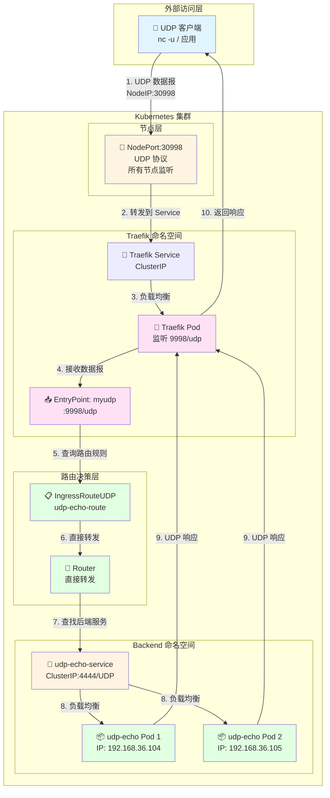
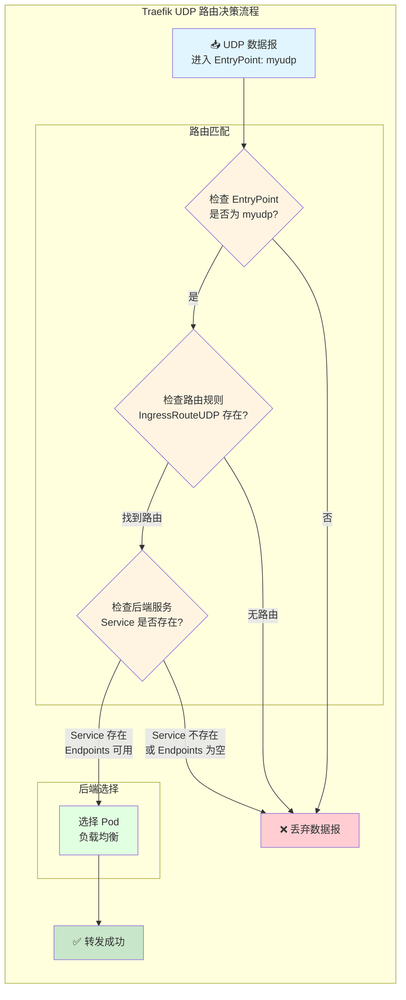
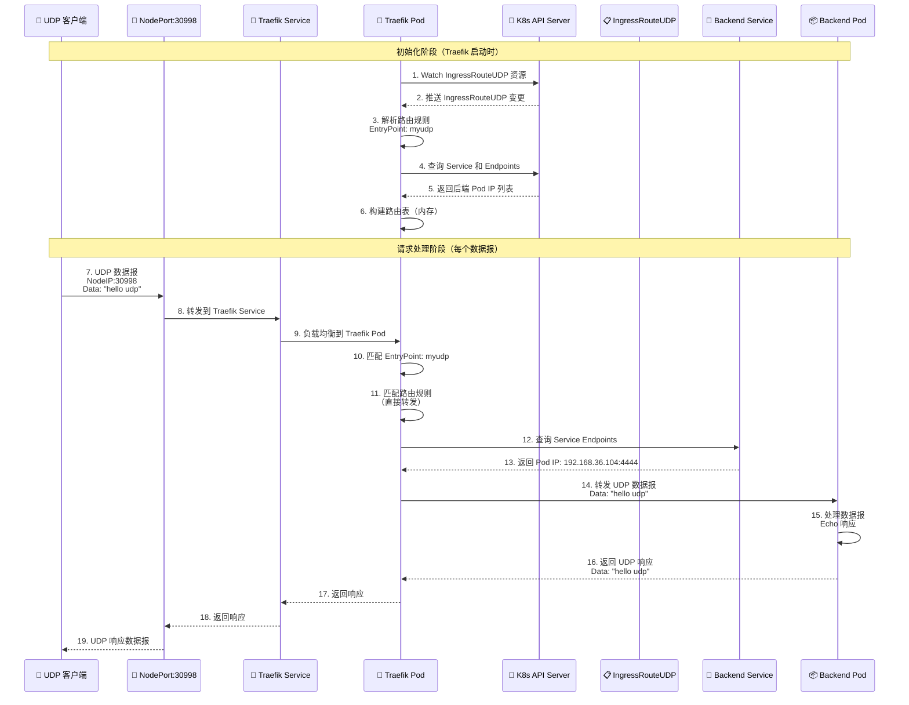

# Kustomize UDP 服务配置指南

**版本**: 1.0  
**日期**: 2025-12-25  
**适用对象**: DevOps 工程师、Kubernetes 管理员

---

## 目录

1. [项目结构标准化](#1-项目结构标准化)
2. [UDP vs TCP 核心区别](#2-udp-vs-tcp-核心区别)
3. [Traefik UDP 架构与原理](#3-traefik-udp-架构与原理)
4. [Base 层配置详解](#4-base-层配置详解)
5. [Overlay 层配置详解](#5-overlay-层配置详解)
6. [应用开发](#6-应用开发)
7. [测试验证](#7-测试验证)
8. [最佳实践](#8-最佳实践)

---

## 1. 项目结构标准化

### 1.1 标准目录结构

遵循与 TCP 服务相同的 GitOps 最佳实践，UDP 服务的结构如下：

```
apps/backend/udp-demo/
├── base/
│   ├── deployment.yaml
│   ├── service.yaml
│   ├── ingress-route-udp.yaml
│   └── kustomization.yaml
└── overlays/
    └── development/
        ├── ingress-traefik-patch.yaml
        ├── patch-resources.yaml
        └── kustomization.yaml
```

### 1.2 结构说明

- **Base 层**: 定义"是什么"（这有一个 UDP 路由）
- **Overlay 层**: 定义"怎么用"（开发环境用 myudp 入口，打上 dev 标签）

---

## 2. UDP vs TCP 核心区别

### 2.1 协议特性对比

| 特性 | TCP | UDP |
|------|-----|-----|
| **连接方式** | 面向连接（需要握手） | 无连接（无需握手） |
| **可靠性** | 可靠（保证送达） | 不可靠（尽力而为） |
| **有序性** | 有序传输 | 不保证顺序 |
| **速度** | 较慢（可靠性开销） | 较快（开销最小） |
| **使用场景** | HTTP、HTTPS、数据库连接 | DNS、游戏、流媒体、实时数据 |

### 2.2 Kubernetes 配置区别

| 配置项 | TCP | UDP |
|--------|-----|-----|
| **Service 协议** | `protocol: TCP`（默认） | `protocol: UDP`（必须指定） |
| **容器端口** | `protocol: TCP`（默认） | `protocol: UDP`（必须指定） |
| **Traefik EntryPoint** | `:9999/tcp` | `:9998/udp` |
| **Traefik CRD** | `IngressRouteTCP` | `IngressRouteUDP` |
| **路由匹配** | 需要 `HostSNI('*')` | 无需匹配（直接转发） |

### 2.3 应用代码区别

**TCP（面向连接）**:
```go
// TCP 需要建立连接
conn, err := net.Dial("tcp", "host:port")
conn.Write(data)
conn.Read(buffer)
```

**UDP（无连接）**:
```go
// UDP 使用数据报套接字
conn, err := net.ListenUDP("udp", addr)
conn.ReadFromUDP(buffer)  // 从任意源接收
conn.WriteToUDP(data, addr)  // 发送到指定地址
```

---

## 3. Traefik UDP 架构与原理

### 3.1 整体架构图

Traefik UDP 服务的完整架构：



### 3.2 UDP 路由原理图

Traefik UDP 路由比 TCP 更简单，因为无需维护连接状态：



**关键点说明**:

1. **无连接状态**: UDP 是无连接的，每个数据报都是独立的
2. **无需匹配规则**: 与 TCP 的 `HostSNI` 不同，UDP 路由直接转发所有流量
3. **服务发现**: Traefik 通过 Kubernetes API 查询 Service 和 Endpoints
4. **负载均衡**: 如果有多个 Pod，Traefik 会对每个数据报进行负载均衡

### 3.3 数据流序列图

完整的 UDP 请求响应流程：



### 3.4 TCP vs UDP 路由对比

```mermaid
graph TB
    subgraph "TCP 路由（面向连接）"
        TCPClient[👤 TCP 客户端]
        TCPTraefik[🚀 Traefik]
        TCPEntryPoint[EntryPoint: mytcp<br/>:9999/tcp]
        TCPRouter{路由决策<br/>HostSNI: *}
        TCPSvc[Service]
        
        TCPClient -->|1. TCP 连接| TCPTraefik
        TCPTraefik --> TCPEntryPoint
        TCPEntryPoint --> TCPRouter
        TCPRouter -->|2. 匹配规则| TCPSvc
        TCPSvc -->|3. 维持连接| TCPClient
    end

    subgraph "UDP 路由（无连接）"
        UDPClient[👤 UDP 客户端]
        UDPTraefik[🚀 Traefik]
        UDPEntryPoint[EntryPoint: myudp<br/>:9998/udp]
        UDPRouter{直接转发<br/>无需匹配}
        UDPSvc[Service]
        
        UDPClient -->|1. UDP 数据报| UDPTraefik
        UDPTraefik --> UDPEntryPoint
        UDPEntryPoint --> UDPRouter
        UDPRouter -->|2. 直接转发| UDPSvc
        UDPSvc -->|3. 响应数据报| UDPClient
    end

    style TCPClient fill:#e1f5ff
    style TCPTraefik fill:#ffe1f5
    style TCPRouter fill:#fff4e1
    style TCPSvc fill:#e1ffe1
    
    style UDPClient fill:#e1f5ff
    style UDPTraefik fill:#ffe1f5
    style UDPRouter fill:#fff4e1
    style UDPSvc fill:#e1ffe1
```



**关键区别**:

| 方面 | TCP | UDP |
|------|-----|-----|
| **连接状态** | 维持连接状态 | 无状态，每个数据报独立 |
| **路由匹配** | 需要 `HostSNI('*')` | 无需匹配，直接转发 |
| **EntryPoint 格式** | `:9999/tcp` | `:9998/udp` |
| **CRD 类型** | `IngressRouteTCP` | `IngressRouteUDP` |
| **路由配置** | 必须指定 `match` 字段 | 无需 `match` 字段 |

---

## 4. Base 层配置详解

### 4.1 Deployment 配置

**文件**: `apps/backend/udp-demo/base/deployment.yaml`

```yaml
apiVersion: apps/v1
kind: Deployment
metadata:
  name: udp-echo-demo
  namespace: backend
  labels:
    app: udp-echo
spec:
  # [副本数]
  # 这是 Base 的默认值。
  # 在 overlays/development/patch-resources.yaml 中，我们会把它覆盖为 1。
  # 在生产环境可能保留这个 10 或者设置更多。
  replicas: 10

  selector:
    matchLabels:
      app: udp-echo # 必须匹配 template 里的标签

  template:
    metadata:
      labels:
        app: udp-echo # 必须匹配 Service 的 selector
    spec:
      containers:
        - name: proxy
          # [核心技巧：镜像占位符]
          # 这里写的不是真实的镜像地址，而是一个逻辑名称。
          # 真实的镜像地址 (newName) 和版本 (newTag) 会在 overlays/*/kustomization.yaml 中
          # 通过 'images' 字段动态替换。
          # 好处：Base 文件与具体镜像仓库解耦。
          image: udp-echo-server

          ports:
            - containerPort: 4444
              protocol: UDP  # ⚠️ [关键] 必须指定 UDP 协议
```

**关键点**:
- **镜像占位符**: `image: udp-echo-server` 不是真实镜像，而是逻辑名称
- **协议声明**: `protocol: UDP` 对于 UDP 服务是必需的
- **标签匹配**: Deployment 的 selector 和 template labels 必须一致

---

### 4.2 Service 配置

**文件**: `apps/backend/udp-demo/base/service.yaml`

```yaml
apiVersion: v1
kind: Service
metadata:
  name: udp-echo-service
  namespace: backend
spec:
  # [服务类型]
  # 这里省略了 type 字段，默认是 ClusterIP。
  # 意味着这个 Service 只能在集群内部访问，外部访问必须通过 Traefik Ingress。

  ports:
    - port: 4444        # [集群内端口] Service 在 ClusterIP 上监听的端口 (Traefik 访问这个)
      targetPort: 4444  # [容器端口] 流量转发给 Pod 里容器实际监听的端口
      protocol: UDP     # ⚠️ [关键] 协议声明，这行不能漏
      name: udp         # 端口命名，好习惯，方便引用

  # [标签选择器]
  # 只有带有 app=udp-echo 标签的 Pod 才会成为这个 Service 的后端。
  selector:
    app: udp-echo
```

**端口映射说明**:
- `port`: Service 在集群内的端口（Traefik 访问这个）
- `targetPort`: Pod 容器实际监听的端口
- `protocol: UDP`: **关键** - 必须指定 UDP 协议
- `name`: 端口名称，便于引用

---

### 4.3 IngressRouteUDP 配置

**文件**: `apps/backend/udp-demo/base/ingress-route-udp.yaml`

```yaml
apiVersion: traefik.io/v1alpha1
kind: IngressRouteUDP  # ⚠️ 注意：这是 Traefik 专用的 CRD，专门处理 UDP 流量
metadata:
  name: udp-echo-route
  namespace: backend
spec:
  # [入口点绑定]
  # 必须对应 Traefik 启动参数 (traefik-app.yaml) 中定义的 entryPoint。
  # 比如: --entrypoints.myudp.address=:9998/udp
  entryPoints:
    - myudp

  routes:
    # [路由规则]
    # UDP 不需要 match 规则（没有 HostSNI），它直接把整个入口流量转发给 Service。
    # 与 TCP 需要 HostSNI('*') 不同，UDP 路由更简单。
    - services:
        - name: udp-echo-service  # 转发给哪个 Service
          port: 4444               # Service 的端口
```

**关键点**:
- **CRD 资源**: `IngressRouteUDP` 是 Traefik 自定义资源，专门处理 UDP 流量
- **无 Match 字段**: UDP 路由不需要 `match` 字段（与 TCP 的 `HostSNI` 不同）
- **直接转发**: 入口点的所有流量直接转发到 Service
- **EntryPoint**: 必须对应 Traefik 配置中的 entryPoint 名称

---

### 4.4 Kustomization 聚合

**文件**: `apps/backend/udp-demo/base/kustomization.yaml`

```yaml
apiVersion: kustomize.config.k8s.io/v1beta1
kind: Kustomization

# [资源清单]
# 列出当前目录下所有需要被包含进来的 YAML 文件。
# ArgoCD 或者 'kubectl apply -k' 会读取这个列表并把它们合并成一个流。
resources:
  - deployment.yaml
  - service.yaml
  - ingress-route-udp.yaml
```

---

## 5. Overlay 层配置详解

### 5.1 资源限制补丁

**文件**: `apps/backend/udp-demo/overlays/development/patch-resources.yaml`

```yaml
# -----------------------------------------------------------------
# 文件名: apps/backend/udp-demo/overlays/development/patch-resources.yaml
# 作用: 针对 Development 环境的差异化补丁 (Patch)
# -----------------------------------------------------------------
apiVersion: apps/v1
kind: Deployment
metadata:
  # [关键] Kustomize 依靠这个名字去 base 里找"受害者"
  # 必须和 base/deployment.yaml 里的名字完全一致
  name: udp-echo-demo

  # 指定命名空间，通常在 kustomization.yaml 里也会统一指定，这里写上也无妨
  namespace: backend

spec:
  # [差异化配置] 副本数
  # 开发环境为了省钱省资源，通常设为 1。
  # 生产环境 (Production) 可能会设为 3 以实现高可用。
  replicas: 1

  template:
    spec:
      containers:
        # [关键] 容器名字
        # Kustomize 需要通过这个名字知道你要修改列表里的哪一个容器。
        # 必须和 base/deployment.yaml 里的 container name 一致 (即 "proxy")。
        - name: proxy

          # [核心修改] 资源配额 (Resource Quotas)
          # 这通常是开发环境和生产环境最大的区别之一。
          resources:

            # 1. Requests (请求值/下限)
            # 含义：Pod 启动时的"最低消费"。
            # 作用：K8s 调度器会寻找剩余资源满足这些要求的节点。如果节点资源不够，Pod 就会 Pending。
            requests:
              # 64 Mebibytes (约等于 67MB)。
              # 注意：Mi 是二进制单位 (1024*1024)，M 是十进制单位 (1000*1000)。K8s 推荐用 Mi。
              memory: "64Mi"

              # 50 millicores (50 毫核)，即 0.05 个 CPU 核心。
              # 1000m = 1 核。50m 是非常小的 CPU 需求，适合开发环境闲置。
              cpu: "50m"

            # 2. Limits (限制值/上限)
            # 含义：Pod 运行时的"最高消费"。
            # 作用：防止应用内存泄漏或 CPU 跑死循环把整个节点搞挂。
            limits:
              # 如果容器使用的内存超过 128Mi，它会被 OOMKilled (Out Of Memory Killed) 重启。
              # 这里的限制比较紧，如果你的 UDP 应用处理大量并发，可能需要调大。
              memory: "128Mi"

              # 如果容器尝试使用超过 100m (0.1 核) 的 CPU，它会被操作系统限流 (Throttling)，变慢但不会死。
              cpu: "100m"
```

**补丁原理**:
- 这不是完整的 Deployment，而是告诉 Kustomize："找到那个叫 `udp-echo-demo` 的 Deployment，只修改我列出来的这些字段，其他保持原样。"
- 为什么不写 `image` 字段？因为 `image` 已经在 base 里定义了，Kustomize 会合并这两个文件。

---

### 5.2 UDP 路由补丁

**文件**: `apps/backend/udp-demo/overlays/development/ingress-traefik-patch.yaml`

```yaml
# -----------------------------------------------------------------
# 文件名: apps/backend/udp-demo/overlays/development/ingress-traefik-patch.yaml
# 作用: 专门修补 IngressRouteUDP 的配置
# -----------------------------------------------------------------
# [类型声明]
# 必须完全匹配 base 文件里的定义，否则 Kustomize 找不到要修补的对象。
apiVersion: traefik.io/v1alpha1
kind: IngressRouteUDP  # ⚠️ 必须匹配 Base 的 Kind

metadata:
  # [定位锚点]
  # Kustomize 通过这里的 name 知道你要修改 base 里的哪个资源。
  name: udp-echo-route
  namespace: backend

  # [Annotations 注解]
  # 这里演示了如何给资源添加额外的元数据。
  # 场景举例：有些监控工具或外部 DNS 插件依赖 annotations 来工作。
  # 下面这一行其实是 Traefik 的一种元数据标记，明确指出该路由属于 myudp 入口点。
  annotations:
    traefik.ingress.kubernetes.io/router.entrypoints: myudp

spec:
  # [EntryPoints 入口点]
  # 这是 Traefik 路由的核心。
  # "myudp" 必须对应你在 traefik-app.yaml (Helm values) 中配置的
  # --entrypoints.myudp.address=:9998/udp
  #
  # 为什么要在补丁里写这个？
  # 1. 显式声明：再次确认开发环境走这个入口。
  # 2. 环境隔离：假如生产环境的入口点叫 "produp" (监听不同端口)，
  #    你就可以在 overlays/production 里的补丁把这里改成 "produp"。
  entryPoints:
    - myudp
```

---

### 5.3 Kustomization 总指挥

**文件**: `apps/backend/udp-demo/overlays/development/kustomization.yaml`

```yaml
# -----------------------------------------------------------------
# 文件名: apps/backend/udp-demo/overlays/development/kustomization.yaml
# 作用: 定义 Development 环境的最终形态
# -----------------------------------------------------------------
apiVersion: kustomize.config.k8s.io/v1beta1
kind: Kustomization

# [资源引用]
# 这里的 ../../base 指向了该应用的基础定义目录。
# Kustomize 会先读取 base 里的 Deployment, Service, IngressRouteUDP，
# 把它们当作"原材料"。
resources:
  - ../../base

# [统一标签管理] (Kustomize v5+ 新语法)
# 作用：给当前环境下的所有资源（包括 Service 的 selector, Deployment 的 Pod template）
# 自动打上这些标签。
# 好处：以后你可以通过 kubectl get all -l environment=development 一键查询开发环境所有资源。
labels:
  - pairs:
      environment: development
      project: ic2

# [补丁列表]
# 这是 Kustomize 最强大的功能：在不修改 base 文件的前提下，修改特定配置。
patches:
  # 1. 针对 Deployment 的补丁
  # 这个文件里定义了 replicas: 1 和 CPU/内存限制。
  - path: patch-resources.yaml
    target:
      kind: Deployment
      name: udp-echo-demo

  # 2. 针对 Traefik IngressRouteUDP 的补丁
  # 这个文件里定义了路由规则的微调。
  - path: ingress-traefik-patch.yaml
    target:
      # [CRD 关键点！！！]
      # 对于 Kubernetes 原生资源 (如 Deployment, Service)，只写 kind 和 name 就够了。
      # 但是！对于 CRD (自定义资源)，如 Traefik 的 IngressRouteUDP，
      # Kustomize 有时会找不到它，所以必须显式指定 group 和 version。
      group: traefik.io      # 对应 apiVersion 的斜杠前部分
      version: v1alpha1      # 对应 apiVersion 的斜杠后部分
      kind: IngressRouteUDP   # ⚠️ 必须准确
      name: udp-echo-route

# [镜像替换策略]
# 这是 Kustomize 中一种非常高级且优雅的用法："占位符模式"（Placeholder Pattern）。
# 
# 为什么这样做很棒？
# 1. 解耦 (Decoupling): Base 不需要知道真实的镜像仓库地址（比如是 DockerHub 还是阿里云）。
#    它只用一个逻辑名称 udp-echo-server 来代表"这里需要一个 UDP Echo 的镜像"。
# 2. 灵活性 (Flexibility):
#    - Development 环境：可以将 udp-echo-server 替换为 iceymoss/udp-echo:dev
#    - Production 环境：可以将 udp-echo-server 替换为 registry.company.com/stable/udp-echo:v1.0.0
# 3. Base 层：永远保持干净，没有任何特定的镜像仓库依赖。
images:
  - name: udp-echo-server    # [重点] 这里必须填 Base 里原本写的那个镜像占位符名称！
    newName: iceymoss/udp-echo # 替换对应的镜像仓库和名称
    newTag: "1.0"             # 替换 Tag
```

**关键知识点**:

1. **Patches 的 target 写法**:
   - **普通资源**（Deployment/Service）：写 `kind` + `name` 即可
   - **CRD 资源**（Traefik/CertManager/Prometheus）：保险起见，一定要写全 `group` + `version` + `kind` + `name`

2. **镜像替换逻辑**:
   - `name`: 必须填 Base 里原本写的镜像占位符名称（如 `udp-echo-server`），不是容器名
   - `newName`: 替换成新的镜像仓库和名称
   - `newTag`: 替换成新的标签

3. **替换流程**:
   ```
   Base: image: udp-echo-server
   ↓
   Overlay: name: udp-echo-server, newName: iceymoss/udp-echo, newTag: "1.0"
   ↓
   最终: image: iceymoss/udp-echo:1.0
   ```

---

## 6. 应用开发

### 6.1 Go UDP 服务器实现

**文件**: `main.go`

```go
package main

import (
	"fmt"
	"net"
	"os"
)

func main() {
	// 监听容器内的 4444 端口 (UDP)
	port := ":4444"
	addr, err := net.ResolveUDPAddr("udp", port)
	if err != nil {
		fmt.Println("Error resolving address:", err)
		os.Exit(1)
	}

	// 建立 UDP 监听
	conn, err := net.ListenUDP("udp", addr)
	if err != nil {
		fmt.Println("Error listening:", err)
		os.Exit(1)
	}
	defer conn.Close()

	fmt.Printf("UDP Echo Server listening on %s\n", port)
	buffer := make([]byte, 1024)

	for {
		// 读取数据
		n, remoteAddr, err := conn.ReadFromUDP(buffer)
		if err != nil {
			fmt.Println("Error reading:", err)
			continue
		}

		fmt.Printf("Received %d bytes from %s: %s\n", n, remoteAddr, string(buffer[:n]))

		// 原样写回 (Echo)
		_, err = conn.WriteToUDP(buffer[:n], remoteAddr)
		if err != nil {
			fmt.Println("Error writing back:", err)
		}
	}
}
```

**关键点**:
- **UDP 套接字**: 使用 `net.ListenUDP` 而不是 `net.Listen`
- **ReadFromUDP**: 从任意源接收数据报（无连接）
- **WriteToUDP**: 发送数据报到指定地址
- **无连接状态**: 每个数据报都是独立的

### 6.2 Dockerfile

**文件**: `Dockerfile`

```dockerfile
FROM golang:1.21-alpine AS builder
WORKDIR /app
COPY main.go .
RUN CGO_ENABLED=0 go build -o udp-server main.go

FROM alpine:latest
WORKDIR /app
COPY --from=builder /app/udp-server .

# ⚠️ 注意这里标明 UDP
EXPOSE 4444/udp

CMD ["./udp-server"]
```

**关键点**:
- **多阶段构建**: 减小最终镜像大小
- **UDP 端口声明**: `EXPOSE 4444/udp` 明确声明 UDP 协议
- **Alpine 基础镜像**: 轻量级基础镜像

### 6.3 构建和推送

```bash
# 构建镜像
docker build -t iceymoss/udp-echo:1.0 .

# 推送到仓库
docker push iceymoss/udp-echo:1.0
```

---

## 7. 测试验证

### 7.1 基础设施升级（Traefik 配置）

在部署业务应用之前，必须先给 Traefik 开"UDP 之门"。

**文件**: `argocd-bootstrap/ingress-controller/traefik-app.yaml`

在 values 里增加 UDP 入口和 NodePort 映射：

```yaml
apiVersion: argoproj.io/v1alpha1
kind: Application
metadata:
  name: traefik-ingress
  namespace: argocd
spec:
  project: default
  source:
    chart: traefik
    repoURL: https://traefik.github.io/charts
    targetRevision: 26.0.0
    helm:
      values: |
        fullnameOverride: "traefik"

        additionalArguments:
          - "--accesslog=true"
          - "--accesslog.format=json"
          - "--entrypoints.mytcp.address=:9999/tcp"
          # 🆕 [新增] 定义 UDP 入口点 (注意 /udp)
          - "--entrypoints.myudp.address=:9998/udp"

        # ... (deployment配置保持不变)

        service:
          type: NodePort
        ports:
          # ... (保留 web, websecure, dashboard, mytcp)

          # 🆕 [新增] 暴露 UDP 端口
          myudp:
            port: 9998        # Traefik 内部监听端口
            expose: true
            exposedPort: 9998
            protocol: UDP     # ⚠️ 必须声明 UDP
            nodePort: 30998   # 对外访问端口
```

**操作**: 提交这个文件，让 ArgoCD 先同步 Traefik。

### 7.2 测试命令

#### 7.2.1 获取节点 IP

```bash
# 获取节点 IP
export NODE_IP=$(kubectl get nodes -o wide | awk 'NR==2{print $6}')
echo "Node IP: $NODE_IP"
```

#### 7.2.2 测试 UDP 连接

**使用 Netcat (nc)**:

```bash
# 发送 UDP 数据报
# -u: UDP 模式（关键）
# -v: 详细模式
nc -v -u $NODE_IP 30998

# 连接后，输入: hello udp
# 如果立刻看到回显，说明 UDP 穿透成功！ 🚀
```

**使用 Socat**:

```bash
# UDP 测试的替代工具
echo "hello udp" | socat - UDP:$NODE_IP:30998
```

#### 7.2.3 验证服务状态

```bash
# 检查 Pod 状态
kubectl get pods -n backend -l app=udp-echo

# 检查 Service
kubectl get svc -n backend udp-echo-service

# 检查 IngressRouteUDP
kubectl get ingressrouteudp -n backend

# 检查 Service Endpoints
kubectl get endpoints -n backend udp-echo-service

# 查看 Pod 日志
kubectl logs -n backend -l app=udp-echo -f
```

### 7.3 验证清单

- [ ] Traefik EntryPoint `myudp` 已配置
- [ ] Traefik Service 暴露了 NodePort 30998
- [ ] UDP Pod 正在运行
- [ ] Service 有正确的 UDP 协议
- [ ] Service Endpoints 可用
- [ ] IngressRouteUDP 已创建
- [ ] UDP 数据报能到达后端 Pod
- [ ] 响应数据报已返回

---

## 8. 最佳实践

### 8.1 目录结构规范

- **Base 层**: 只包含通用配置，不包含环境特定信息
- **Overlay 层**: 包含环境差异化配置（资源限制、副本数、镜像标签等）
- **命名规范**: 保持与 `hello-api` 等 HTTP 服务一致的结构

### 8.2 镜像管理

- **占位符模式**: Base 中使用逻辑名称（如 `udp-echo-server`）
- **环境隔离**: 不同环境使用不同的镜像标签
- **解耦设计**: Base 层不依赖具体镜像仓库

### 8.3 资源限制

- **开发环境**: 设置较小的 Limits，防止 Bug 代码吃光集群资源
- **生产环境**: Requests 设置得高一点（预留足够资源），Limits 也会放宽
- **QoS 等级**: 生产环境可以让 Requests == Limits (QoS Class: Guaranteed) 来获得最高的稳定性

### 8.4 UDP 路由配置

- **EntryPoint 命名**: 使用有意义的名称（如 `myudp`, `dns`, `streaming`）
- **端口规划**: 提前规划好端口分配，避免冲突
- **文档记录**: 在文档中记录每个 UDP 服务使用的端口和 EntryPoint

### 8.5 协议声明

**关键**: 始终明确声明 `protocol: UDP` 在：
- 容器端口规范中
- Service 端口规范中
- Traefik EntryPoint（`/udp` 后缀）

### 8.6 多服务管理

- **端口分配表**: 维护一个端口分配表，记录每个服务使用的端口
- **统一配置**: 在 Traefik 配置中统一管理所有 EntryPoint
- **命名规范**: 使用一致的命名规范（如 `{service-name}-route`）

---

## 附录

### A. 端口分配示例表

| 服务名称 | EntryPoint | Traefik 端口 | NodePort | 协议 | 用途 |
|---------|-----------|-------------|----------|------|------|
| tcp-demo | mytcp | 9999 | 30999 | TCP | TCP Echo 服务 |
| udp-demo | myudp | 9998 | 30998 | UDP | UDP Echo 服务 |
| redis-demo | redis | 6379 | 30379 | TCP | Redis 服务 |
| dns-demo | dns | 53 | 30053 | UDP | DNS 服务 |

### B. 常用命令

```bash
# 查看所有 IngressRouteUDP
kubectl get ingressrouteudp -A

# 查看 Traefik EntryPoints
kubectl logs -n traefik -l app.kubernetes.io/name=traefik | grep entrypoint

# 测试 UDP 连接
nc -v -u <NodeIP> <NodePort>

# 替代方案：使用 socat
echo "test" | socat - UDP:<NodeIP>:<NodePort>

# 查看 Service Endpoints
kubectl get endpoints -n backend

# 查看 Pod 日志
kubectl logs -n backend -l app=udp-echo -f
```

### C. 参考资源

- [Kustomize 官方文档](https://kustomize.io/)
- [Traefik IngressRouteUDP 文档](https://doc.traefik.io/traefik/routing/providers/kubernetes-crd/#kind-ingressrouteudp)
- [Kubernetes Service 文档](https://kubernetes.io/docs/concepts/services-networking/service/)
- [UDP 协议规范](https://tools.ietf.org/html/rfc768)

---

**文档维护**: 本文档应随项目配置更新及时更新。  
**最后更新**: 2025-12-25

