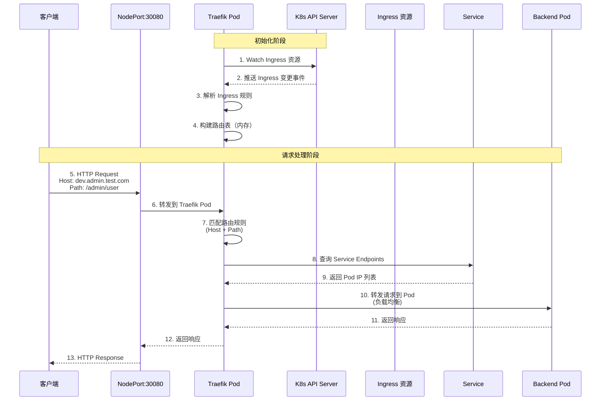

# Traefik Ingress Controller 链路排查与验证指南

**版本**: 1.0  
**日期**: 2025-12-25  
**适用对象**: DevOps 工程师、Kubernetes 管理员、系统架构师

---

## 目录

1. [Traefik Ingress Controller 工作原理](#1-traefik-ingress-controller-工作原理)
2. [项目部署架构分析](#2-项目部署架构分析)
3. [链路验证方法](#3-链路验证方法)
4. [日志解读与分析](#4-日志解读与分析)
5. [故障排查](#5-故障排查)
6. [最佳实践](#6-最佳实践)

---

## 1. Traefik Ingress Controller 工作原理

### 1.1 核心概念

Traefik 是一个现代的 HTTP 反向代理和负载均衡器，作为 Kubernetes Ingress Controller 运行。它的核心职责是：

1. **监听 Kubernetes API**: 实时监听 Ingress、Service、Endpoint 等资源的变化
2. **路由决策**: 根据 Ingress 规则进行路由匹配
3. **流量转发**: 将匹配的请求转发到对应的后端 Service
4. **负载均衡**: 在多个 Pod 之间分发流量

### 1.2 工作流程



### 1.3 关键组件说明

#### Provider（提供者）

Traefik 通过 Provider 从不同来源获取配置：

- **Kubernetes Ingress Provider**: 监听标准的 Kubernetes Ingress 资源
- **Kubernetes CRD Provider**: 监听 Traefik 自定义资源（如 IngressRoute、Middleware）

**项目配置**:
```yaml
providers:
  kubernetesCRD:
    enabled: true      # 启用 CRD Provider（支持 Middleware）
    allowCrossNamespace: true
  kubernetesIngress:
    enabled: true      # 启用标准 Ingress Provider
```

#### EntryPoint（入口点）

EntryPoint 定义 Traefik 监听的端口：

- **web**: HTTP 入口（默认 80，项目配置为 NodePort 30080）
- **websecure**: HTTPS 入口（默认 443，项目配置为 NodePort 30443）

**项目配置**:
```yaml
service:
  type: NodePort
ports:
  web:
    nodePort: 30080
  websecure:
    nodePort: 30443
```

#### Router（路由器）

Router 根据规则（Host、Path、Header 等）匹配请求，并决定转发到哪个 Service。

#### Service（服务）

Service 是 Traefik 内部的概念，对应 Kubernetes 的 Service，包含后端 Pod 的地址列表。

---

## 2. 项目部署架构分析

### 2.1 完整数据流

基于项目实际配置，完整的请求链路如下：

```
客户端 (curl/browser)
    ↓
NodePort:30080 (k8s-master: 10.4.4.15 或 k8s-node1: 10.4.0.17)
    ↓
Traefik Service (ClusterIP)
    ↓
Traefik Pod (监听 8000 端口)
    ↓
路由匹配 (根据 Ingress 规则)
    ↓
Backend Service (admin-api Service)
    ↓
Backend Pod (admin-api Pod, IP: 192.168.36.102)
    ↓
应用响应
```

### 2.2 关键资源配置

#### Traefik IngressClass

**文件**: `apps/infrastructure/traefik/base/ingress-class.yaml`

```yaml
apiVersion: networking.k8s.io/v1
kind: IngressClass
metadata:
  name: traefik
  annotations:
    ingressclass.kubernetes.io/is-default-class: "true"
spec:
  controller: traefik.io/ingress-controller
```

**作用**: 标识 Traefik 作为 Ingress Controller，并设为默认类。

#### 业务 Ingress 规则

**文件**: `apps/backend/admin-api/base/ingress.yaml`

```yaml
apiVersion: networking.k8s.io/v1
kind: Ingress
metadata:
  name: admin-api-ingress
  annotations:
    kubernetes.io/ingress.class: traefik
spec:
  ingressClassName: traefik
  rules:
    - host: dev.admin.test.com
      http:
        paths:
          - path: /admin
            pathType: Prefix
            backend:
              service:
                name: admin-api
                port:
                  number: 80
```

**路由逻辑**:
- **Host 匹配**: `dev.admin.test.com`
- **Path 匹配**: `/admin` (Prefix 类型，匹配所有以 `/admin` 开头的路径)
- **后端服务**: `admin-api:80`

### 2.3 路由匹配机制

Traefik 的路由匹配遵循以下优先级：

1. **精确匹配优先**: 更具体的规则优先匹配
2. **Host 匹配**: 首先检查 `Host` 头
3. **Path 匹配**: 然后检查 `Path` 和 `PathType`
4. **其他规则**: Header、Query 等（如果配置）

**示例**:
- 请求 `Host: dev.admin.test.com, Path: /admin/user` → ✅ 匹配 `admin-api-ingress`
- 请求 `Host: dev.admin.test.com, Path: /hello` → ❌ 不匹配（404）
- 请求 `Host: dev.hello.test.com, Path: /hello` → ✅ 匹配 `hello-api-ingress`（如果存在）

---

## 3. 链路验证方法

### 3.1 方法一：查看 Traefik 访问日志（最直接证据）

#### 3.1.1 启用访问日志

Traefik 默认不开启访问日志，需要手动启用：

```bash
# 编辑 Traefik Deployment
kubectl edit deployment -n traefik traefik-ingress
```

在 `spec.template.spec.containers[0].args` 中添加：

```yaml
- args:
  - --accesslog=true          # 启用访问日志
  - --accesslog.format=json   # 可选：JSON 格式（更易解析）
  - --entrypoints.web.address=:8000/tcp
  # ... 其他参数
```

保存后，Traefik Pod 会自动重启。

#### 3.1.2 实时监控日志

打开两个终端窗口：

**窗口 A（监控日志）**:
```bash
kubectl logs -f -n traefik -l app.kubernetes.io/name=traefik
```

**窗口 B（发起请求）**:
```bash
# 获取节点 IP
export NODE_IP=$(kubectl get nodes -o wide | grep -v NAME | awk '{print $6}' | head -1)

# 发起请求
curl -v -H "Host: dev.admin.test.com" http://$NODE_IP:30080/admin/user
```

#### 3.1.3 预期日志输出

**成功请求日志**:
```
10.4.0.17 - - [25/Dec/2025:02:40:00 +0000] "GET /admin/user HTTP/1.1" 200 55 "-" "-" 19 "backend-admin-api-ingress-dev-admin-test-com-admin@kubernetes" "http://192.168.36.102:8080" 2ms
```

**日志字段解读**:
- `10.4.0.17`: 客户端 IP
- `GET /admin/user HTTP/1.1`: 请求方法和路径
- `200`: HTTP 状态码
- `55`: 响应体大小（字节）
- `19`: 请求序号
- `backend-admin-api-ingress-dev-admin-test-com-admin@kubernetes`: **Router Name**（关键！证明匹配了 Ingress 规则）
- `http://192.168.36.102:8080`: **目标地址**（后端 Pod IP 和端口）
- `2ms`: 响应时间

**结论**: 如果看到 Router Name 和目标地址都有值，说明请求成功经过 Traefik 并转发到后端。

---

### 3.2 方法二：后端应用验证（通过 HTTP Header）

Traefik 在转发请求时会添加标准的代理头，后端应用可以通过这些头来验证请求来源。

#### 3.2.1 Traefik 添加的 Header

- `X-Forwarded-For`: 原始客户端 IP
- `X-Forwarded-Host`: 原始 Host 头
- `X-Forwarded-Proto`: 原始协议（http/https）
- `X-Forwarded-Server`: Traefik 服务器名称
- `X-Real-IP`: 真实客户端 IP

#### 3.2.2 验证方法

**方法 A: 查看后端应用日志**

如果后端应用记录了客户端 IP，可以对比：

```bash
# 查看后端 Pod 日志
kubectl logs -f -n backend -l app.kubernetes.io/name=admin-api

# 发起请求
curl -H "Host: dev.admin.test.com" http://$NODE_IP:30080/admin/user
```

**预期**: 日志中显示的 IP 应该是 Traefik Pod 的 IP 或节点 IP（取决于网络模式），而不是原始客户端 IP。

**方法 B: 在 Pod 内抓包**

```bash
# 进入后端 Pod
kubectl exec -it -n backend $(kubectl get pod -n backend -l app.kubernetes.io/name=admin-api -o jsonpath='{.items[0].metadata.name}') -- sh

# 安装 tcpdump（如果镜像支持）
# 或者使用其他工具查看请求头
```

---

### 3.3 方法三：Traefik Dashboard 可视化验证

#### 3.3.1 访问 Dashboard

**方式 A: Port Forward（临时）**
```bash
kubectl port-forward -n traefik $(kubectl get pod -n traefik -l app.kubernetes.io/name=traefik -o jsonpath='{.items[0].metadata.name}') 9000:9000
```

然后浏览器访问: `http://localhost:9000/dashboard/`

**方式 B: 通过 Ingress（如果配置了）**
```bash
# 查看 Dashboard Ingress
kubectl get ingressroute -n traefik
```

#### 3.3.2 验证路由状态

1. 点击 **HTTP Routers**
2. 搜索 `dev.admin.test.com`
3. 查看路由状态

**预期结果**:
- **状态**: Success (绿色)
- **Rule**: `Host(dev.admin.test.com) && PathPrefix(/admin)`
- **Service**: `admin-api@backend`
- **EntryPoint**: `web`

**结论**: 如果路由状态为 Success，说明 Traefik 已经识别并加载了 Ingress 规则。

---

### 3.4 方法四：拔线测试（负向验证）

这是最简单粗暴但也最有效的逻辑验证：如果关闭 Traefik，服务中断，说明流量确实走 Traefik。

#### 3.4.1 测试步骤

**步骤 1: 缩容 Traefik**
```bash
kubectl scale deployment -n traefik traefik-ingress --replicas=0
```

**步骤 2: 等待 Pod 终止**
```bash
kubectl get pods -n traefik -w
```

**步骤 3: 发起请求**
```bash
curl -v -H "Host: dev.admin.test.com" http://$NODE_IP:30080/admin/user
```

**预期结果**: 
- `Connection refused` 或
- 请求一直转圈（Timeout）

**原因**: 监听 30080 端口的 Traefik Pod 已经不存在，请求无法到达。

**步骤 4: 恢复 Traefik**
```bash
kubectl scale deployment -n traefik traefik-ingress --replicas=1

# 等待 Pod 启动
kubectl wait --for=condition=ready pod -n traefik -l app.kubernetes.io/name=traefik --timeout=60s
```

**步骤 5: 再次请求**
```bash
curl -H "Host: dev.admin.test.com" http://$NODE_IP:30080/admin/user
```

**预期结果**: 请求成功，返回 200 OK。

**结论**: 这证明了 Traefik 是流量的唯一入口。

---

### 3.5 方法五：端口和 Service 验证

#### 3.5.1 验证 NodePort 监听

```bash
# 查看 NodePort Service
kubectl get svc -n traefik traefik-ingress

# 在节点上检查端口监听
# 在 Master 或 Worker 节点上执行
sudo netstat -tlnp | grep 30080
# 或
sudo ss -tlnp | grep 30080
```

**预期输出**: 应该看到 Traefik 进程在监听 30080 端口。

#### 3.5.2 验证后端 Service

```bash
# 查看后端 Service
kubectl get svc -n backend admin-api

# 查看 Service 的 Endpoints（后端 Pod IP）
kubectl get endpoints -n backend admin-api
```

**预期输出**: Endpoints 应该包含后端 Pod 的 IP 和端口。

#### 3.5.3 验证 Pod 连通性

```bash
# 从 Traefik Pod 测试到后端 Service 的连通性
kubectl exec -n traefik $(kubectl get pod -n traefik -l app.kubernetes.io/name=traefik -o jsonpath='{.items[0].metadata.name}') -- \
  wget -qO- http://admin-api.backend.svc.cluster.local/admin/user
```

**预期结果**: 如果能正常返回数据，说明 Traefik Pod 可以访问后端 Service。

---

## 4. 日志解读与分析

### 4.1 成功转发的请求

**日志示例**:
```
10.4.0.17 - - [25/Dec/2025:02:40:00 +0000] "GET /admin/user HTTP/1.1" 200 55 "-" "-" 19 "backend-admin-api-ingress-dev-admin-test-com-admin@kubernetes" "http://192.168.36.102:8080" 2ms
```

**解读**:
- ✅ **Router Name 有值**: `backend-admin-api-ingress-dev-admin-test-com-admin@kubernetes`
  - 说明 Traefik 成功匹配了 Ingress 规则
  - 规则来源: `backend` 命名空间的 `admin-api-ingress`
- ✅ **Target URL 有值**: `http://192.168.36.102:8080`
  - 说明 Traefik 找到了后端 Pod 并转发请求
  - `192.168.36.102` 是后端 Pod 的 IP
- ✅ **状态码 200**: 请求成功
- ✅ **响应时间 2ms**: 性能正常

**结论**: 链路完全正常，请求成功经过 Traefik 到达后端 Pod。

---

### 4.2 后端返回的 404（应用层 404）

**日志示例**:
```
10.4.0.17 - - [25/Dec/2025:02:40:05 +0000] "GET /admin/user/1 HTTP/1.1" 404 18 "-" "-" 25 "backend-admin-api-ingress-dev-admin-test-com-admin@kubernetes" "http://192.168.36.102:8080" 0ms
```

**解读**:
- ✅ **Router Name 有值**: 说明 Traefik 路由匹配成功
- ✅ **Target URL 有值**: 说明请求已转发到后端
- ❌ **状态码 404**: 这是**后端应用返回的 404**，不是 Traefik 的 404

**原因**: 后端应用（Go 程序）没有注册 `/admin/user/1` 这个路由。

**结论**: 链路正常，问题在后端应用逻辑。

---

### 4.3 Traefik 拦截的 404（路由层 404）

**日志示例**:
```
10.4.0.17 - - [25/Dec/2025:02:40:10 +0000] "GET /admin HTTP/1.1" 404 19 "-" "-" 26 "-" "-" 0ms
10.4.0.17 - - [25/Dec/2025:02:40:15 +0000] "GET / HTTP/1.1" 404 19 "-" "-" 27 "-" "-" 0ms
```

**解读**:
- ❌ **Router Name 为空**: `-`（没有匹配到任何 Ingress 规则）
- ❌ **Target URL 为空**: `-`（没有转发到后端）
- ❌ **状态码 404**: Traefik 自己返回的 404

**可能原因**:
1. 请求缺少 `Host` 头（如直接访问 IP）
2. `Host` 头不匹配任何 Ingress 规则
3. `Path` 不匹配任何 Ingress 规则

**验证方法**:
```bash
# 错误示例（缺少 Host 头）
curl http://$NODE_IP:30080/admin/user

# 正确示例（包含 Host 头）
curl -H "Host: dev.admin.test.com" http://$NODE_IP:30080/admin/user
```

**结论**: Traefik 正常工作，但请求不符合任何路由规则。

---

### 4.4 日志对比表

| 场景 | Router Name | Target URL | 状态码 | 说明 |
|------|------------|------------|--------|------|
| 成功转发 | ✅ 有值 | ✅ 有值 | 200 | 链路正常，后端正常响应 |
| 应用 404 | ✅ 有值 | ✅ 有值 | 404 | 链路正常，后端路由不存在 |
| 路由 404 | ❌ 空 (`-`) | ❌ 空 (`-`) | 404 | Traefik 未匹配到规则 |
| 后端错误 | ✅ 有值 | ✅ 有值 | 500/502/503 | 链路正常，后端异常 |
| 连接失败 | ✅ 有值 | ✅ 有值 | 502 | 链路正常，但无法连接后端 Pod |

---

## 5. 故障排查

### 5.1 问题：请求返回 404，Router Name 为空

**症状**: 日志显示 Router Name 为 `-`，Target URL 为 `-`

**排查步骤**:

```bash
# 1. 检查 Ingress 是否存在
kubectl get ingress -n backend admin-api-ingress

# 2. 检查 IngressClass 是否存在
kubectl get ingressclass traefik

# 3. 检查 Ingress 的 ingressClassName
kubectl get ingress -n backend admin-api-ingress -o jsonpath='{.spec.ingressClassName}'

# 4. 检查请求的 Host 头
# 确保请求包含正确的 Host 头
curl -v -H "Host: dev.admin.test.com" http://$NODE_IP:30080/admin/user
```

**常见原因**:
- 请求缺少 `Host` 头
- `Host` 头不匹配 Ingress 规则
- Ingress 的 `ingressClassName` 配置错误

---

### 5.2 问题：请求返回 502 Bad Gateway

**症状**: 日志显示 Router Name 有值，但 Target URL 返回 502

**排查步骤**:

```bash
# 1. 检查后端 Service 是否存在
kubectl get svc -n backend admin-api

# 2. 检查 Service 的 Endpoints
kubectl get endpoints -n backend admin-api

# 3. 检查后端 Pod 是否运行
kubectl get pods -n backend -l app.kubernetes.io/name=admin-api

# 4. 检查后端 Pod 日志
kubectl logs -n backend -l app.kubernetes.io/name=admin-api --tail=50

# 5. 从 Traefik Pod 测试连接
kubectl exec -n traefik $(kubectl get pod -n traefik -l app.kubernetes.io/name=traefik -o jsonpath='{.items[0].metadata.name}') -- \
  wget -qO- --timeout=5 http://admin-api.backend.svc.cluster.local/admin/user
```

**常见原因**:
- 后端 Pod 未运行或崩溃
- Service 没有选择到 Pod（Selector 不匹配）
- 网络策略阻止了连接
- 后端应用未监听指定端口

---

### 5.3 问题：请求超时

**症状**: 请求一直转圈，最终超时

**排查步骤**:

```bash
# 1. 检查 Traefik Pod 状态
kubectl get pods -n traefik

# 2. 检查 Traefik Pod 日志
kubectl logs -n traefik -l app.kubernetes.io/name=traefik --tail=100

# 3. 检查 NodePort Service
kubectl get svc -n traefik traefik-ingress

# 4. 检查节点端口监听
# 在节点上执行
sudo netstat -tlnp | grep 30080

# 5. 检查防火墙规则
sudo iptables -L -n | grep 30080
```

**常见原因**:
- Traefik Pod 未运行
- NodePort Service 配置错误
- 防火墙阻止了端口
- 节点网络问题

---

### 5.4 问题：Traefik 日志不显示

**症状**: 即使启用了 `--accesslog=true`，仍然看不到日志

**排查步骤**:

```bash
# 1. 检查 Traefik 配置
kubectl get deployment -n traefik traefik-ingress -o yaml | grep -A 20 "args:"

# 2. 检查 Pod 是否重启（配置是否生效）
kubectl get pods -n traefik -l app.kubernetes.io/name=traefik

# 3. 查看 Pod 启动参数
kubectl get pod -n traefik -l app.kubernetes.io/name=traefik -o jsonpath='{.items[0].spec.containers[0].args}'

# 4. 检查日志级别
kubectl logs -n traefik -l app.kubernetes.io/name=traefik | head -20
```

**解决方案**:
- 确认 `--accesslog=true` 已添加到 args
- 等待 Pod 重启完成
- 检查日志输出是否被重定向

---

## 6. 最佳实践

### 6.1 启用访问日志

**生产环境**: 建议启用访问日志并配置日志轮转，但要注意磁盘空间。

**开发/测试环境**: 强烈建议启用，便于调试和验证。

```yaml
# 在 Traefik Helm values 中添加
additionalArguments:
  - --accesslog=true
  - --accesslog.format=json  # JSON 格式便于解析
  - --accesslog.fields.defaultmode=keep
  - --accesslog.fields.headers.defaultmode=keep
```

### 6.2 监控关键指标

建议监控以下指标：

- **请求成功率**: 2xx / 总请求数
- **响应时间**: P50, P95, P99
- **错误率**: 4xx, 5xx 比例
- **后端健康**: 后端 Pod 可用性

### 6.3 路由规则设计

- **使用明确的 Host**: 避免使用通配符，提高匹配准确性
- **Path 前缀匹配**: 使用 `PathType: Prefix` 时注意路径顺序
- **默认 IngressClass**: 设置默认类，避免遗漏配置

### 6.4 测试验证清单

在部署新服务前，建议执行以下验证：

- [ ] Ingress 资源已创建
- [ ] IngressClass 配置正确
- [ ] 后端 Service 和 Pod 正常运行
- [ ] Traefik 日志显示路由匹配成功
- [ ] 请求能正常到达后端
- [ ] 响应时间在可接受范围内

---

## 附录

### A. 常用命令速查

| 操作 | 命令 |
|------|------|
| 查看 Traefik Pod | `kubectl get pods -n traefik` |
| 查看 Traefik 日志 | `kubectl logs -f -n traefik -l app.kubernetes.io/name=traefik` |
| 查看 Ingress | `kubectl get ingress -A` |
| 查看 IngressClass | `kubectl get ingressclass` |
| 查看 Service | `kubectl get svc -n traefik traefik-ingress` |
| 查看 Endpoints | `kubectl get endpoints -n backend admin-api` |
| 测试连接 | `curl -H "Host: dev.admin.test.com" http://$NODE_IP:30080/admin/user` |

### B. 参考资源

- [Traefik 官方文档](https://doc.traefik.io/traefik/)
- [Kubernetes Ingress 文档](https://kubernetes.io/docs/concepts/services-networking/ingress/)
- [Traefik Ingress Controller 指南](https://doc.traefik.io/traefik/routing/providers/kubernetes-ingress/)

---

**文档维护**: 本文档应随 Traefik 版本和项目配置更新及时更新。  
**最后更新**: 2025-12-25

