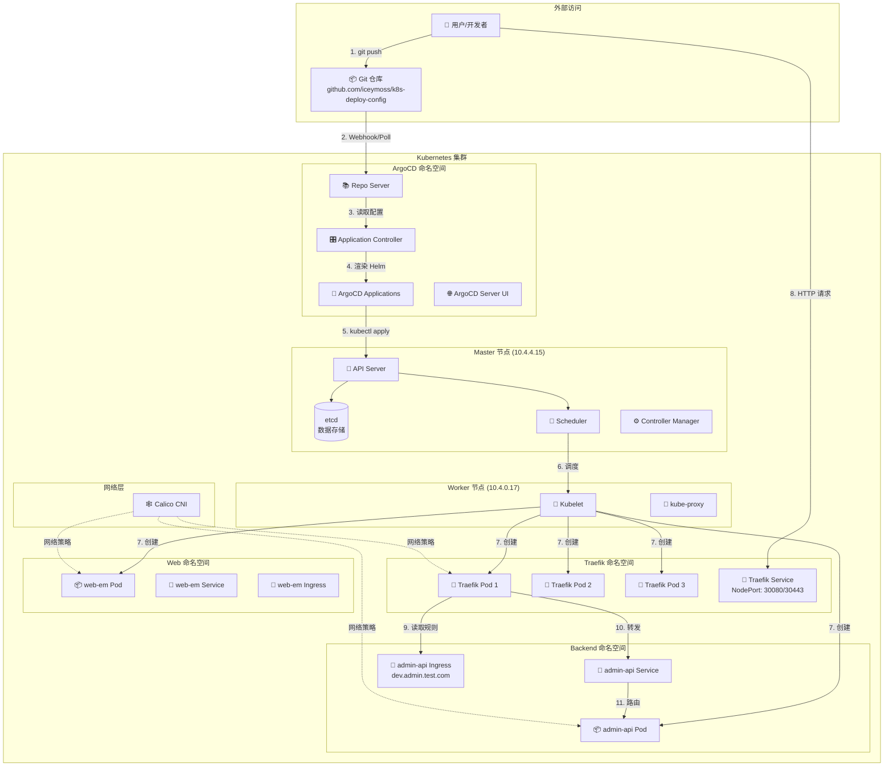
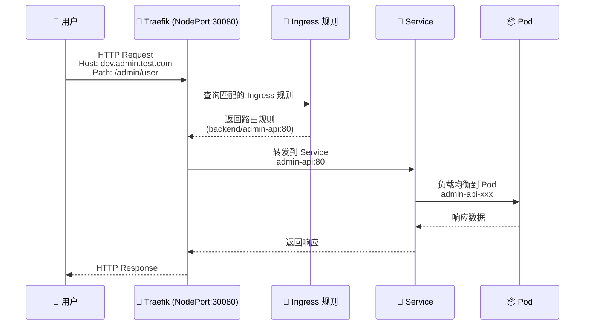
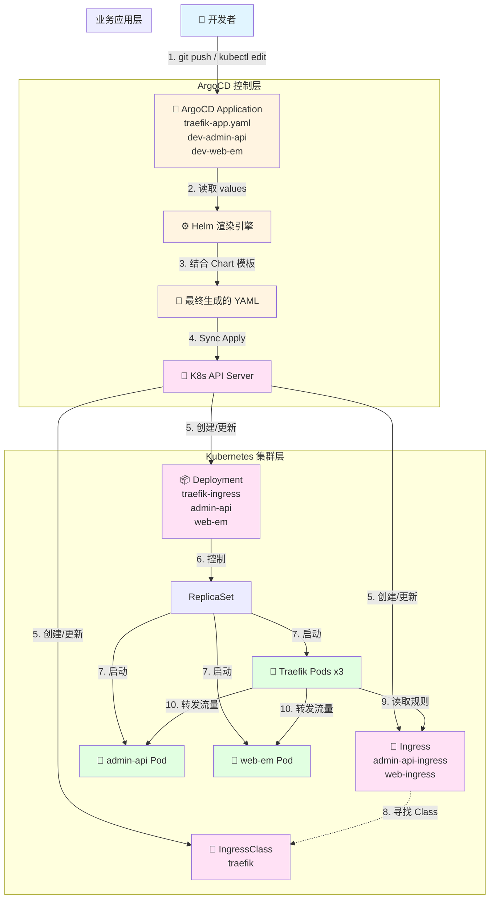

# Kubernetes 集群架构与 ArgoCD + Traefik 配置流向深度解析文档

**版本**: 1.0  
**日期**: 2025-12-25  
**适用对象**: DevOps 工程师、Kubernetes 管理员、系统架构师

---

## 目录

1. [系统概述](#1-系统概述)
2. [集群架构](#2-集群架构)
3. [配置流向全景图](#3-配置流向全景图)
4. [层级详细拆解与操作命令](#4-层级详细拆解与操作命令)
5. [核心知识点与防坑指南](#5-核心知识点与防坑指南)
6. [实际项目配置说明](#6-实际项目配置说明)
7. [故障排查指南](#7-故障排查指南)

---

## 1. 系统概述

本系统采用 **GitOps 模式**，通过层级传导机制管理集群配置。整个流程可以类比为一个严密的"发号施令"过程：

- **你 (开发者)**: 发布指令 (Git Commit)
- **ArgoCD (大管家)**: 接收指令并协调资源
- **Helm (翻译官)**: 将配置参数翻译成 Kubernetes 能懂的清单
- **Kubernetes (包工头)**: 分配任务给具体资源控制器
- **Pod (工人)**: 最终干活的运行单元

### 1.1 当前集群状态

#### 节点信息

| 节点名称 | 角色 | 状态 | 内部IP | 版本 | 容器运行时 |
|---------|------|------|--------|------|-----------|
| k8s-master | control-plane | Ready | 10.4.4.15 | v1.29.15 | containerd://2.2.1 |
| k8s-node1 | worker | Ready | 10.4.0.17 | v1.29.15 | containerd://2.2.1 |

#### 命名空间概览

- **argocd**: ArgoCD 控制平面
- **backend**: 后端服务 (admin-api)
- **web**: 前端服务 (web-em)
- **traefik**: Traefik Ingress Controller
- **calico-system**: Calico 网络插件
- **kube-system**: Kubernetes 核心组件
- **kubernetes-dashboard**: Kubernetes Dashboard UI

---

## 2. 集群架构

### 2.1 整体架构图



### 2.2 网络流量路径



---

## 3. 配置流向全景图

下图展示了从用户修改配置到流量转发生效的完整数据流：



---

## 4. 层级详细拆解与操作命令

### 第一层：源头 (Source of Truth)

**角色**: 圣旨 (GitOps 入口)

**核心文件**:
- `argocd-bootstrap/ingress-controller/traefik-app.yaml` (Traefik Helm Chart 配置)
- `argocd-bootstrap/backend/application-dev.yaml` (后端服务 Application)
- `argocd-bootstrap/web/application-dev.yaml` (前端服务 Application)

**功能**: 定义期望状态。例如，在 `spec.source.helm.values` 中定义 `replicas: 3`。

**⚠️ 避坑**: 注意 `parameters` 字段优先级高于 `values`，避免残留配置覆盖 Git 文件。

#### 🛠️ 常用命令

```bash
# 1. 提交配置修改 (推荐)
git add argocd-bootstrap/ingress-controller/traefik-app.yaml
git commit -m "scale traefik to 3 replicas"
git push origin master

# 2. 紧急手动修改 (不推荐，仅用于调试)
kubectl -n argocd edit application traefik-ingress

# 3. 查看 ArgoCD 实际加载的配置 (检查 parameters 是否存在)
kubectl -n argocd get application traefik-ingress -o yaml

# 4. 查看所有 ArgoCD Applications
kubectl -n argocd get applications
```

---

### 第二层：渲染 (Templating)

**角色**: 翻译官 (Helm Engine)

**组件**: ArgoCD 内部 Helm 引擎

**功能**: 将 `values` 与 Chart 模板结合，生成最终的 Kubernetes YAML。

**逻辑**: `Deployment.yaml` 模板 + `replicas: 3` = 最终 YAML。

**⚠️ 避坑**: Helm 模板中常包含 `if/else` 逻辑，`0` 可能被视为空值而导致默认值 `1` 生效。

#### 🛠️ 常用命令

```bash
# 1. 预览 Helm 渲染后的最终清单 (不应用，只看结果)
# 如果你安装了 argocd cli:
argocd app manifests traefik-ingress --source live

# 2. 本地调试 Helm 模板 (模拟 ArgoCD 的行为)
helm template traefik https://traefik.github.io/charts \
  --version 26.0.0 \
  -f values.yaml \
  --debug

# 3. 查看 ArgoCD 生成的最终清单
kubectl -n argocd get application traefik-ingress -o jsonpath='{.status.sync.resources[*].manifest}' | yq eval -P -
```

---

### 第三层：状态同步 (Sync)

**角色**: 监工 (Controller)

**组件**: ArgoCD Application Controller

**功能**: 对比"期望状态 (Git)"与"实际状态 (Cluster)"。若不一致，执行 `kubectl apply`。

**⚠️ 避坑**: `kubectl edit` 看到的 `status.history` 是 ArgoCD 的操作流水账，修改配置时应忽略该部分。

#### 🛠️ 常用命令

```bash
# 1. 触发手动同步
# CLI 方式:
argocd app sync traefik-ingress

# 暴力 Patch 方式 (强制刷新):
kubectl -n argocd patch application traefik-ingress \
  --type merge \
  -p '{"operation": {"sync": {"prune": true, "syncStrategy": {"hook": {"force": true}}}}}'

# 2. 查看同步状态和差异
argocd app diff traefik-ingress

# 3. 查看同步历史
kubectl -n argocd get application traefik-ingress -o jsonpath='{.status.history[*]}' | jq

# 4. 查看所有应用的同步状态
kubectl -n argocd get applications -o wide
```

---

### 第四层：资源落地 (Realization)

**角色**: 工头 (K8s Controllers)

**对象**: Deployment, IngressClass, Service, Ingress

**功能**:
- **Deployment**: 确保 Pod 数量符合 `spec.replicas`
- **IngressClass**: 确立 Traefik 的"身份"，使其有资格接管流量
- **Service**: 提供稳定的网络端点
- **Ingress**: 定义路由规则

#### 🛠️ 常用命令

```bash
# 1. 检查 Deployment 状态 (查看副本数是否生效)
kubectl get deployment -n traefik traefik-ingress
kubectl get deployment -n backend admin-api
kubectl get deployment -n web web-em

# 2. 检查 Pod 状态
kubectl get pods -n traefik -o wide
kubectl get pods -n backend -o wide
kubectl get pods -n web -o wide

# 3. 检查 IngressClass 身份是否注册
kubectl get ingressclass

# 4. 检查 Service
kubectl get svc -n traefik
kubectl get svc -n backend
kubectl get svc -n web

# 5. 检查 Ingress 规则
kubectl get ingress -A
kubectl describe ingress -n backend admin-api-ingress
```

---

### 第五层：流量接管 (Networking)

**角色**: 路牌 (Routing Rules)

**对象**: Ingress (业务层的路由规则)

**功能**: 业务 Ingress 声明 `ingressClassName: traefik`。Traefik Pod 监听到该规则后，加载到内存并转发流量。

#### 🛠️ 常用命令

```bash
# 1. 查看业务 Ingress 是否被接管 (ADDRESS 列是否有 IP)
kubectl get ingress -n backend
kubectl get ingress -n web

# 2. 查看 Traefik 实时日志 (验证是否加载了配置)
kubectl logs -f -n traefik -l app.kubernetes.io/name=traefik

# 3. 验证访问链路
# 从集群外部访问
curl -v -H "Host: dev.admin.test.com" http://10.4.4.15:30080/admin/user
curl -v -H "Host: dev.admin.test.com" http://10.4.0.17:30080/admin/user

# 从集群内部访问
kubectl run -it --rm debug --image=curlimages/curl --restart=Never -- \
  curl -v http://admin-api.backend.svc.cluster.local/admin/user

# 4. 查看 Traefik Dashboard (如果配置了)
# 访问: http://traefik.test.com/dashboard/ (需要配置 hosts 或使用 port-forward)
kubectl port-forward -n traefik svc/traefik-ingress 9000:9000
# 然后访问: http://localhost:9000/dashboard/
```

---

## 5. 核心知识点与防坑指南 (Troubleshooting)

### 🚨 优先级铁律

ArgoCD 配置生效的优先级顺序如下（从高到低）：

1. **Helm Parameters** (`argocd app set` 或 YAML 中的 `spec.source.helm.parameters`)
2. **Helm Values** (Git 中的 `values.yaml` 或 Application 中的 `values: |`)
3. **Chart Default Values** (Chart 自带的 `values.yaml`)

**⚠️ 教训**: 永远不要在 Application YAML 中保留 `parameters` 块，除非你明确知道其作用。它会悄无声息地覆盖你在 `values` 里写的配置。

### 🤖 Helm 的"智能"陷阱

在 Go Template 中，数字 `0` 常被视为 `false` 或 `empty`。如果 Chart 写法是 `{{ .Values.replicas | default 1 }}`，当你传入 `0` 时，Helm 会认为你没传值，从而使用默认值 `1`。

**⚠️ 教训**:
- 若需缩容到 0，需确认 Chart 逻辑支持
- 紧急情况下，可绕过 ArgoCD 直接使用 `kubectl scale deployment ... --replicas=0` 验证，之后再排查配置

### 📜 ArgoCD 的历史记录

使用 `kubectl edit application` 时，会看到底部有大量的 `status` 和 `history` 信息，这看起来像重复的配置。

**⚠️ 教训**:
- 这是 ArgoCD 的"日记本"（Snapshots）
- 修改配置时，完全无视 `status` 字段，只专注于修改最上方的 `spec` 字段

### 🔄 同步策略说明

当前项目使用的同步策略：

```yaml
syncPolicy:
  automated:
    prune: true      # 自动删除 Git 中不存在的资源
    selfHeal: true   # 自动修复被手动修改的资源
```

**含义**:
- `prune: true`: 如果 Git 中删除了某个资源，ArgoCD 会自动从集群中删除
- `selfHeal: true`: 如果有人用 `kubectl edit` 修改了资源，ArgoCD 会自动恢复为 Git 中的状态

---

## 6. 实际项目配置说明

### 6.1 Traefik 配置

**文件位置**: `argocd-bootstrap/ingress-controller/traefik-app.yaml`

**关键配置**:
- **Chart 版本**: `26.0.0`
- **副本数**: `1` (可根据需要调整)
- **服务类型**: `NodePort`
- **端口映射**:
  - HTTP: `30080`
  - HTTPS: `30443`
- **IngressClass**: 设为默认 (`isDefaultClass: true`)
- **Provider**: 同时启用 `kubernetesCRD` 和 `kubernetesIngress`

**当前运行状态**:
```bash
# 查看 Traefik Pods
kubectl get pods -n traefik
# 输出: 3 个 traefik-ingress Pods (实际运行中)

# 查看 Traefik Service
kubectl get svc -n traefik
# 输出: traefik-ingress NodePort 服务
```

### 6.2 后端服务配置

**文件位置**: `argocd-bootstrap/backend/application-dev.yaml`

**特点**:
- 使用 **Git Generator** 自动发现服务
- 扫描路径: `apps/backend/*/overlays/development`
- 自动为每个服务创建 Application

**当前服务**:
- `dev-admin-api`: 管理后台 API
  - 域名: `dev.admin.test.com`
  - 路径: `/admin`
  - 命名空间: `backend`

### 6.3 前端服务配置

**文件位置**: `argocd-bootstrap/web/application-dev.yaml`

**当前服务**:
- `dev-web-em`: 前端应用
  - 命名空间: `web`

### 6.4 Ingress 规则配置

**后端服务 Ingress**: `apps/backend/admin-api/base/ingress.yaml`
```yaml
spec:
  ingressClassName: traefik
  rules:
    - host: dev.admin.test.com
      http:
        paths:
          - path: /admin
            pathType: Prefix
            backend:
              service:
                name: admin-api
                port:
                  number: 80
```

**IngressClass**: `apps/infrastructure/traefik/base/ingress-class.yaml`
```yaml
metadata:
  name: traefik
  annotations:
    ingressclass.kubernetes.io/is-default-class: "true"
spec:
  controller: traefik.io/ingress-controller
```

---

## 7. 故障排查指南

### 7.1 Pod 无法启动

**症状**: Pod 状态为 `Pending` 或 `CrashLoopBackOff`

**排查步骤**:
```bash
# 1. 查看 Pod 详细信息
kubectl describe pod <pod-name> -n <namespace>

# 2. 查看 Pod 日志
kubectl logs <pod-name> -n <namespace>

# 3. 查看事件
kubectl get events -n <namespace> --sort-by='.lastTimestamp'

# 4. 检查资源配额
kubectl describe nodes
```

### 7.2 Ingress 无法访问

**症状**: 通过域名访问返回 404 或连接超时

**排查步骤**:
```bash
# 1. 检查 Ingress 是否被 Traefik 识别
kubectl get ingress -n <namespace>
kubectl describe ingress <ingress-name> -n <namespace>

# 2. 检查 IngressClass
kubectl get ingressclass

# 3. 检查 Traefik Pod 日志
kubectl logs -n traefik -l app.kubernetes.io/name=traefik --tail=100

# 4. 检查 Service 和 Endpoints
kubectl get svc -n <namespace>
kubectl get endpoints -n <namespace>

# 5. 测试内部访问
kubectl run -it --rm debug --image=curlimages/curl --restart=Never -- \
  curl -v http://<service-name>.<namespace>.svc.cluster.local
```

### 7.3 ArgoCD 同步失败

**症状**: Application 状态为 `Unknown` 或 `Degraded`

**排查步骤**:
```bash
# 1. 查看 Application 状态
kubectl -n argocd get application <app-name>
kubectl -n argocd describe application <app-name>

# 2. 查看 ArgoCD Controller 日志
kubectl logs -n argocd -l app.kubernetes.io/name=argocd-application-controller --tail=100

# 3. 查看 Repo Server 日志
kubectl logs -n argocd -l app.kubernetes.io/name=argocd-repo-server --tail=100

# 4. 手动触发同步
argocd app sync <app-name>

# 5. 查看同步差异
argocd app diff <app-name>
```

### 7.4 配置不生效

**症状**: 修改了 Git 配置但集群中未更新

**排查步骤**:
```bash
# 1. 确认 Git 已推送
git log --oneline -5

# 2. 检查 ArgoCD 是否检测到变更
kubectl -n argocd get application <app-name> -o jsonpath='{.status.sync.status}'

# 3. 检查 Application 的 source 配置
kubectl -n argocd get application <app-name> -o yaml | grep -A 10 "source:"

# 4. 检查是否有 parameters 覆盖 values
kubectl -n argocd get application <app-name> -o yaml | grep -A 5 "parameters:"

# 5. 强制刷新
kubectl -n argocd patch application <app-name> \
  --type merge \
  -p '{"metadata":{"annotations":{"argocd.argoproj.io/refresh":"hard"}}}'
```

### 7.5 网络连接问题

**症状**: Pod 之间无法通信

**排查步骤**:
```bash
# 1. 检查 Calico 状态
kubectl get pods -n calico-system

# 2. 检查网络策略
kubectl get networkpolicies -A

# 3. 检查节点网络
ip route show
ip addr show

# 4. 测试 Pod 网络
kubectl run -it --rm debug --image=nicolaka/netshoot --restart=Never -- \
  ping <target-pod-ip>
```

---

## 附录

### A. 常用命令速查表

| 操作 | 命令 |
|------|------|
| 查看所有节点 | `kubectl get nodes -o wide` |
| 查看所有 Pods | `kubectl get pods -A` |
| 查看所有命名空间 | `kubectl get namespaces` |
| 查看 ArgoCD Applications | `kubectl -n argocd get applications` |
| 查看 Traefik Pods | `kubectl get pods -n traefik` |
| 查看 Ingress 规则 | `kubectl get ingress -A` |
| 查看 Service | `kubectl get svc -A` |
| 查看 Deployment | `kubectl get deployment -A` |

### B. 重要文件路径

| 文件 | 路径 |
|------|------|
| Traefik Application | `argocd-bootstrap/ingress-controller/traefik-app.yaml` |
| 后端服务 Application | `argocd-bootstrap/backend/application-dev.yaml` |
| 前端服务 Application | `argocd-bootstrap/web/application-dev.yaml` |
| Traefik IngressClass | `apps/infrastructure/traefik/base/ingress-class.yaml` |
| Admin API Ingress | `apps/backend/admin-api/base/ingress.yaml` |

### C. 参考资源

- [ArgoCD 官方文档](https://argo-cd.readthedocs.io/)
- [Traefik 官方文档](https://doc.traefik.io/traefik/)
- [Kubernetes Ingress 文档](https://kubernetes.io/docs/concepts/services-networking/ingress/)
- [Helm 官方文档](https://helm.sh/docs/)

---

**文档维护**: 本文档应随项目配置变更及时更新。  
**最后更新**: 2025-12-25

